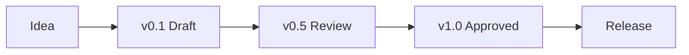

---
document:
  id: DOC-001
  name: DOCUMENT_TEMPLATE
  title: RAE Platform Official Document Standard
  version: 0.1.0
  status: Draft
  owner: RAE Platform Architecture
  category: Foundation
  type: Standard
  release: v0.1.0 Foundation
  language:
    primary: English
    secondary: Spanish
  last_updated: YYYY-MM-DD
---

# DOCUMENT_TEMPLATE

> Official documentation standard for every document created inside the RAE Platform Knowledge Base.

---

# 1. Purpose

This document defines the official documentation standard of RAE Platform.

Every document created inside this repository MUST follow this specification.

The objective is to guarantee consistency, readability, scalability, maintainability and AI compatibility across the entire Knowledge Base.

This specification applies equally to:

- Business documents
- Product specifications
- Technical specifications
- Architecture documents
- API specifications
- Database specifications
- Infrastructure
- UX
- Design System
- AI
- Analytics
- Security
- Operations
- Future modules

No document may intentionally ignore this standard unless an approved Architectural Decision Record (ADR/DEC) explicitly authorizes an exception.

---

# 2. Why this standard exists

Large software projects fail because knowledge becomes fragmented.

RAE Platform adopts the philosophy that documentation is part of the product.

Good documentation should allow:

- a developer to implement a feature;
- a product manager to understand business goals;
- a designer to understand the intended user experience;
- an architect to understand system evolution;
- an AI agent to reason about the project without additional explanations.

This standard establishes a single language for everyone.

---

# 3. Guiding Principles

Every document produced for RAE Platform must follow these principles.

## 3.1 Single Source of Truth

Each concept must have one official place where it is defined.

Duplicated knowledge should be avoided.

---

## 3.2 Human First

Documentation must be easy to read.

Avoid unnecessary complexity.

Write with clarity.

---

## 3.3 AI Ready

Every document should be understandable by AI systems.

Information must be explicit.

Avoid hidden assumptions.

Avoid ambiguous terminology.

---

## 3.4 Modular Documentation

Documents should reference each other instead of duplicating information.

---

## 3.5 Long-term Maintainability

Every document should remain useful years after its creation.

Avoid temporary wording.

Avoid implementation details unless required.

---

## 3.6 Vendor Independence

No document may force the architecture to depend on a specific provider unless explicitly approved.

Example:

Wrong

Music Generation = Mureka

Correct

Music Generation Provider

Supported Providers

- Mureka
- Suno
- Stable Audio
- Udio

---

# 4. Document Lifecycle

Every official document follows the same lifecycle.

Definitions

### Idea

Concept under discussion.

Not part of the official Knowledge Base.

### v0.1 Draft

First complete implementation.

### v0.5 Review

Document reviewed.

Architecture validated.

Business validated.

Technical consistency validated.

### v1.0 Approved

Official document.

Reference for future work.

### Release

Published inside the official repository.

---

# 5. Document Identity

Every document MUST include a technical identity.

Minimum fields:

| Field | Required |
|--------|----------|
| Document ID | Yes |
| Title | Yes |
| Version | Yes |
| Status | Yes |
| Category | Yes |
| Owner | Yes |
| Release | Yes |
| Last Updated | Yes |

Example

DOC-014

Campaign Engine

Version

1.2.0

Status

Approved

Release

v0.5.0

Owner

Architecture Team

---

# 6. Mandatory Sections

Unless explicitly justified, every document should include the following sections.

1. Purpose

2. Executive Summary

3. Scope

4. Business Context

5. Technical Context

6. Functional Description

7. Architecture

8. Knowledge Graph

9. AI Context

10. Risks

11. Acceptance Criteria

12. Related Documents

13. Change History

---

# 7. Optional Sections

Depending on the document type, additional sections may exist.

Examples

- Database Schema
- APIs
- SQL
- JSON
- YAML
- Mermaid
- Security
- UX
- Accessibility
- Performance
- Analytics
- Cost
- Monitoring

Optional sections must add value.

Never add sections only to increase document size.

---

# 8. Standard Document Structure

Every official RAE Platform document should follow the same logical reading order.

The objective is that any person or AI agent can immediately understand where information is located without learning a different structure for every document.

The recommended structure is:

1. Technical Sheet
2. Executive Summary
3. Purpose
4. Scope
5. Business Context
6. Technical Context
7. Functional Description
8. Architecture
9. Components
10. Data Model (if applicable)
11. APIs (if applicable)
12. Events (if applicable)
13. User Experience (if applicable)
14. AI Context
15. Knowledge Graph
16. Risks
17. Acceptance Criteria
18. Future Evolution
19. References
20. Change History

Documents may omit sections that are not applicable.

However, omitted sections should never reduce understanding of the document.

---

# 9. Technical Sheet

Every document begins with a Technical Sheet.

The Technical Sheet provides a standardized identity for the document.

Minimum fields include:

| Field | Required |
|--------|----------|
| Document ID | Yes |
| Title | Yes |
| Version | Yes |
| Status | Yes |
| Owner | Yes |
| Category | Yes |
| Release | Yes |
| Created | Yes |
| Last Updated | Yes |

Optional fields:

- Authors
- Reviewers
- Tags
- Domain
- Module
- Related Documents
- Dependencies

Purpose:

Allow humans and AI systems to identify the document immediately.

---

# 10. Executive Summary

## Purpose

Provide a high-level explanation of the document.

This section should answer:

- What is this?
- Why does it exist?
- Who should read it?

The Executive Summary should not explain implementation details.

Recommended size:

150–300 words.

---

# 11. Purpose

Describe the specific objective of the document.

A good Purpose section explains:

- Why the document exists.
- What decision it supports.
- What problem it solves.

Avoid describing implementation.

---

# 12. Scope

Define the boundaries of the document.

Include:

What is included.

What is intentionally excluded.

Assumptions.

Dependencies.

A document without Scope usually creates ambiguity.

---

# 13. Business Context

Explain the business motivation.

Questions to answer:

Why does this capability matter?

Who benefits?

Which business objective does it support?

Which KPI could improve?

Avoid technical implementation.

---

# 14. Technical Context

Describe the technical environment.

Typical contents:

System architecture.

Dependencies.

External systems.

Internal modules.

Events.

Databases.

Infrastructure.

This section connects business language with engineering language.

---

# 15. Functional Description

Describe how the capability behaves.

Recommended subsections:

Inputs

Outputs

Business Rules

Validations

Exceptions

Expected Results

Avoid implementation code.

Describe behavior.

---

# 16. Architecture

Every architecture description should prioritize visual understanding.

Whenever possible include:

Mermaid

Sequence diagrams

Flowcharts

Component diagrams

State diagrams

Architecture diagrams

Text should complement diagrams.

Never replace them.

---

# 17. Components

List the components involved.

Example:

| Component | Responsibility |
|------------|----------------|
| Scheduler | Plans playback |
| Smart DJ | Generates playlists |
| Campaign Engine | Injects promotions |
| Edge Node | Executes locally |

Each component should reference its own specification.

Avoid duplicating documentation.

---

# 18. Data Model

If the document introduces data structures, include:

Entities

Relationships

Identifiers

Lifecycle

Constraints

Use Mermaid ER diagrams whenever possible.

Example:

Customer

↓

Playlist

↓

Track

↓

Campaign

↓

Playback

---

# 19. APIs

If APIs exist:

Document:

Endpoint

Method

Authentication

Inputs

Outputs

Errors

Rate Limits

Related Events

Example requests and responses should use JSON.

---

# 20. Events

Event-driven architecture is encouraged.

Each event should describe:

Name

Producer

Consumers

Payload

Trigger

Expected behavior

Events should reference their own Event Specification whenever available.
