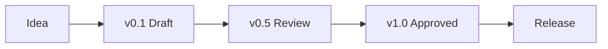

---
document:
  id: DOC-001
  name: DOCUMENT_TEMPLATE
  title: RAE Platform Official Document Standard
  version: 0.1.0
  status: Draft
  owner: RAE Platform Architecture
  category: Foundation
  type: Standard
  release: v0.1.0 Foundation
  language:
    primary: English
    secondary: Spanish
  last_updated: YYYY-MM-DD
---

# DOCUMENT_TEMPLATE

> Official documentation standard for every document created inside the RAE Platform Knowledge Base.

---

# 1. Purpose

This document defines the official documentation standard of RAE Platform.

Every document created inside this repository MUST follow this specification.

The objective is to guarantee consistency, readability, scalability, maintainability and AI compatibility across the entire Knowledge Base.

This specification applies equally to:

- Business documents
- Product specifications
- Technical specifications
- Architecture documents
- API specifications
- Database specifications
- Infrastructure
- UX
- Design System
- AI
- Analytics
- Security
- Operations
- Future modules

No document may intentionally ignore this standard unless an approved Architectural Decision Record (ADR/DEC) explicitly authorizes an exception.

---

# 2. Why this standard exists

Large software projects fail because knowledge becomes fragmented.

RAE Platform adopts the philosophy that documentation is part of the product.

Good documentation should allow:

- a developer to implement a feature;
- a product manager to understand business goals;
- a designer to understand the intended user experience;
- an architect to understand system evolution;
- an AI agent to reason about the project without additional explanations.

This standard establishes a single language for everyone.

---

# 3. Guiding Principles

Every document produced for RAE Platform must follow these principles.

## 3.1 Single Source of Truth

Each concept must have one official place where it is defined.

Duplicated knowledge should be avoided.

---

## 3.2 Human First

Documentation must be easy to read.

Avoid unnecessary complexity.

Write with clarity.

---

## 3.3 AI Ready

Every document should be understandable by AI systems.

Information must be explicit.

Avoid hidden assumptions.

Avoid ambiguous terminology.

---

## 3.4 Modular Documentation

Documents should reference each other instead of duplicating information.

---

## 3.5 Long-term Maintainability

Every document should remain useful years after its creation.

Avoid temporary wording.

Avoid implementation details unless required.

---

## 3.6 Vendor Independence

No document may force the architecture to depend on a specific provider unless explicitly approved.

Example:

Wrong

Music Generation = Mureka

Correct

Music Generation Provider

Supported Providers

- Mureka
- Suno
- Stable Audio
- Udio

---

# 4. Document Lifecycle

Every official document follows the same lifecycle.

Definitions

### Idea

Concept under discussion.

Not part of the official Knowledge Base.

### v0.1 Draft

First complete implementation.

### v0.5 Review

Document reviewed.

Architecture validated.

Business validated.

Technical consistency validated.

### v1.0 Approved

Official document.

Reference for future work.

### Release

Published inside the official repository.

---

# 5. Document Identity

Every document MUST include a technical identity.

Minimum fields:

| Field | Required |
|--------|----------|
| Document ID | Yes |
| Title | Yes |
| Version | Yes |
| Status | Yes |
| Category | Yes |
| Owner | Yes |
| Release | Yes |
| Last Updated | Yes |

Example

DOC-014

Campaign Engine

Version

1.2.0

Status

Approved

Release

v0.5.0

Owner

Architecture Team

---

# 6. Mandatory Sections

Unless explicitly justified, every document should include the following sections.

1. Purpose

2. Executive Summary

3. Scope

4. Business Context

5. Technical Context

6. Functional Description

7. Architecture

8. Knowledge Graph

9. AI Context

10. Risks

11. Acceptance Criteria

12. Related Documents

13. Change History

---

# 7. Optional Sections

Depending on the document type, additional sections may exist.

Examples

- Database Schema
- APIs
- SQL
- JSON
- YAML
- Mermaid
- Security
- UX
- Accessibility
- Performance
- Analytics
- Cost
- Monitoring

Optional sections must add value.

Never add sections only to increase document size.
