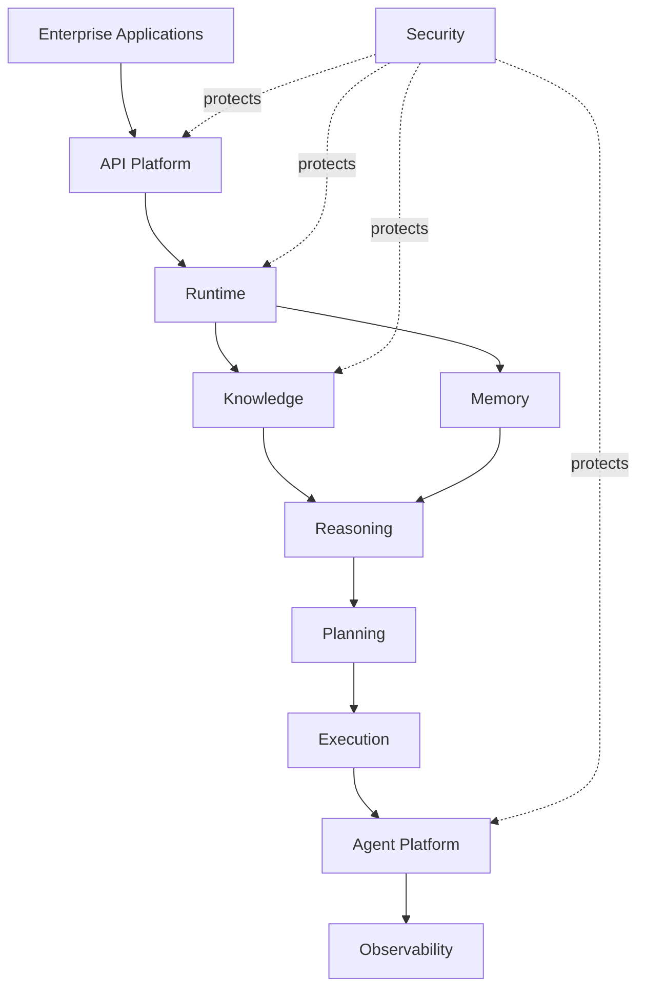

---
document:
  id: DOC-007
  title: ECOS_LOGICAL_ARCHITECTURE
  version: 1.0.0
  status: Draft
  category: Enterprise Architecture
  type: Logical Architecture
  owner: Enterprise Architecture Board
  release: ECOS v1.0 Foundation
  domain: Architecture
  ddl: DDL-1

architecture:
  layer: Architecture
  abstraction: Logical
  audience:
    - Enterprise Architects
    - Solution Architects
    - Platform Engineers
  reusable: true
  maturity: Core
---

# ECOS Logical Architecture

---

# Executive Summary

The Logical Architecture describes how ECOS capabilities collaborate to deliver enterprise cognitive functionality.

Unlike the Conceptual Architecture, which defines *what* ECOS is, the Logical Architecture defines *how* platform capabilities interact without prescribing technologies or deployment models.

This architecture serves as the canonical reference for all future implementations.

---

# Purpose

The logical architecture establishes:

- Capability interactions
- Logical boundaries
- Dependency rules
- Platform flows
- Extension points
- Communication contracts

---

# Architectural Goals

- High cohesion
- Low coupling
- Independent evolution
- Technology neutrality
- Horizontal scalability
- Explainability
- Security by design

---

# Logical View

---

# Logical Capability Layers

## Consumer Layer

External applications.

Examples

- RAE Platform
- Future Products

Responsibilities

- Consume APIs
- Execute business workflows

---

## Platform Layer

Coordinates platform execution.

Capabilities

- API Platform
- Runtime
- Security
- Observability

---

## Intelligence Layer

Provides cognitive functions.

Capabilities

- Knowledge
- Memory
- Reasoning
- Planning
- Execution

---

## Agent Layer

Coordinates intelligent autonomous execution.

Capabilities

- Agent Platform
- Skills
- Tool Registry
- Agent Orchestration

---

## Cross-Cutting Layer

Shared capabilities.

- Identity
- Security
- Governance
- Telemetry
- Policy Engine

---

# Capability Communication

Capabilities communicate through:

- APIs
- Events
- Commands
- Queries

No capability may directly access another capability's internal implementation.

---

# Dependency Rules

Allowed

Upper Layer

↓

Lower Layer

Forbidden

Lower Layer

↓

Upper Layer

Circular dependencies are prohibited.

---

# Platform Flow

Client Request

↓

Authentication

↓

Authorization

↓

API Platform

↓

Runtime

↓

Knowledge Retrieval

↓

Memory Retrieval

↓

Reasoning

↓

Planning

↓

Execution

↓

Agent Actions

↓

Telemetry

↓

Response

---

# Extension Points

Supported extension mechanisms include:

- Plugins
- SDK
- External APIs
- Event Subscribers
- Custom Policies
- AI Providers

Extensions shall not modify the Core.

---

# Security Boundaries

Security applies to every capability.

No capability bypasses:

- Authentication
- Authorization
- Audit
- Policy Enforcement

---

# Observability Boundaries

Every logical interaction generates:

- Logs
- Metrics
- Traces
- Audit Events

---

# Architecture Decisions

## ADR-007-001

The Runtime orchestrates platform execution but does not contain business logic.

---

## ADR-007-002

Knowledge and Memory remain independent capabilities.

---

## ADR-007-003

Reasoning never directly invokes external systems.

Execution performs integrations.

---

## ADR-007-004

Applications communicate exclusively through the API Platform.

---

# Alternatives Considered

Alternative

Direct communication between capabilities.

Decision

Rejected.

Reason

Creates tight coupling and reduces maintainability.

---

# Consequences

Positive

- Stable interfaces
- Independent evolution
- Easier testing
- Better scalability

Negative

- More explicit contracts
- Additional interface definitions

---

# KPIs

Logical Coupling

Dependency Health

Extension Compatibility

API Stability

Capability Isolation

---

# Risks

Hidden dependencies

Architecture erosion

Direct capability access

Layer violations

---

# Dependencies

DOC-004 ECOS_MASTER_ARCHITECTURE

DOC-005 ECOS_CONCEPTUAL_ARCHITECTURE

DOC-006 ECOS_CAPABILITY_MODEL

---

# Related Documents

DOC-008 ECOS_PHYSICAL_ARCHITECTURE

DOC-009 ECOS_LAYER_MODEL

DOC-010 ECOS_DEPENDENCY_MODEL

DOC-011 ECOS_DOCUMENTATION_STANDARD

---

# Success Criteria

The logical architecture is successful when:

Every capability interaction is explicitly defined.

Capabilities evolve independently.

No circular dependencies exist.

Applications remain isolated from Core implementations.

The architecture supports future products without redesign.

---

# Approval

Status

Draft

Pending Enterprise Architecture Board Approval.
