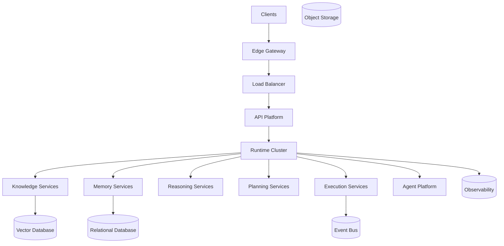

---
document:
  id: DOC-008
  title: ECOS_PHYSICAL_ARCHITECTURE
  version: 1.0.0
  status: Draft
  category: Enterprise Architecture
  type: Physical Architecture
  owner: Enterprise Architecture Board
  release: ECOS v1.0 Foundation
  domain: Architecture
  ddl: DDL-1

architecture:
  layer: Architecture
  abstraction: Physical
  audience:
    - Enterprise Architects
    - Infrastructure Architects
    - DevOps Engineers
    - Platform Engineers
  reusable: true
  maturity: Core
---

# ECOS Physical Architecture

---

# Executive Summary

The Physical Architecture defines how the logical capabilities of ECOS are deployed into infrastructure components.

It intentionally remains cloud-agnostic and vendor-neutral while defining the mandatory runtime building blocks required to operate ECOS in production.

This document specifies deployment topology, infrastructure boundaries, communication mechanisms and operational responsibilities.

---

# Purpose

Define the physical realization of the ECOS platform.

The physical architecture answers:

- Where capabilities execute.
- How services communicate.
- How infrastructure scales.
- How workloads are isolated.
- How resilience is achieved.

---

# Design Principles

The physical architecture shall be:

- Cloud Agnostic
- Vendor Neutral
- Container Native
- API Driven
- Secure by Default
- Highly Available
- Horizontally Scalable
- Observable

---

# Canonical Deployment Model

---

# Physical Layers

## Client Layer

Examples

- Web Applications
- Mobile Applications
- APIs
- CLI
- SDK

---

## Edge Layer

Responsibilities

- TLS termination
- Rate limiting
- Routing
- Web Application Firewall
- API Gateway

---

## Platform Layer

Runs ECOS capabilities.

Supports horizontal scaling.

Stateless where possible.

---

## Data Layer

Persistent services.

Includes

- Relational Database
- Vector Database
- Object Storage
- Cache

---

## Operations Layer

Includes

- Monitoring
- Logging
- Metrics
- Tracing
- Alerting
- Backup

---

# Deployment Units

Every capability shall be deployable independently.

Deployment units include:

- Containers
- Services
- Workers
- Scheduled Jobs
- Event Consumers

---

# Infrastructure Principles

Infrastructure shall support:

- Rolling Deployments
- Blue-Green Deployments
- Canary Releases
- Automatic Recovery
- Auto Scaling

---

# Availability

Target

99.9% minimum

Critical capabilities

99.99%

---

# Resilience

Support:

- Retry Policies
- Circuit Breakers
- Bulkheads
- Health Checks
- Failover

---

# Scalability

Horizontal scaling is preferred.

Vertical scaling shall be considered temporary.

---

# Networking

Service communication shall occur over secure internal networks.

Public exposure is restricted to the Edge Layer.

---

# Security

Mandatory controls include:

- TLS
- Secrets Management
- Identity Federation
- Network Segmentation
- Encryption at Rest
- Encryption in Transit

---

# Storage Strategy

Data is categorized as:

- Transactional
- Analytical
- Knowledge
- Memory
- Telemetry
- Configuration

Each category may use different storage technologies.

---

# Disaster Recovery

Support:

- Automated Backups
- Cross-Region Replication
- Point-in-Time Recovery
- Infrastructure as Code
- Immutable Deployments

---

# Architecture Decisions

## ADR-008-001

Capabilities shall be independently deployable.

---

## ADR-008-002

The platform shall not depend on any single cloud provider.

---

## ADR-008-003

Persistent state shall remain outside compute services.

---

## ADR-008-004

Infrastructure shall be fully reproducible through Infrastructure as Code.

---

# Alternatives Considered

Alternative

Monolithic deployment.

Decision

Rejected.

Reason

Limits scalability and independent evolution.

---

# Consequences

Positive

- Independent deployments
- Fault isolation
- Elastic scaling
- Technology flexibility

Negative

- Greater operational complexity
- Increased infrastructure governance

---

# KPIs

Deployment Frequency

Recovery Time (MTTR)

Availability

Resource Utilization

Deployment Success Rate

Infrastructure Drift

---

# Risks

Vendor Lock-in

Infrastructure Drift

Single Points of Failure

Configuration Drift

Operational Complexity

---

# Dependencies

DOC-004 ECOS_MASTER_ARCHITECTURE

DOC-005 ECOS_CONCEPTUAL_ARCHITECTURE

DOC-006 ECOS_CAPABILITY_MODEL

DOC-007 ECOS_LOGICAL_ARCHITECTURE

---

# Related Documents

DOC-009 ECOS_LAYER_MODEL

DOC-010 ECOS_DEPENDENCY_MODEL

DOC-011 ECOS_DOCUMENTATION_STANDARD

Future Infrastructure Specifications

---

# Success Criteria

The physical architecture is successful when:

Capabilities are independently deployable.

Infrastructure remains cloud agnostic.

High availability objectives are achieved.

Platform growth does not require architectural redesign.

Infrastructure can be reproduced automatically.

---

# Approval

Status

Draft

Pending Enterprise Architecture Board Approval.
