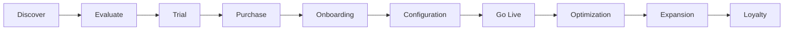

---
document:
  id: DOC-017
  title: CUSTOMER_JOURNEY
  version: 0.1.0
  status: Draft
  category: Business
  type: Journey
  owner: RAE Platform Architecture
  release: v0.2.0 Business
  domain: Business
  ddl: DDL-1
---

# Customer Journey

> Complete lifecycle of a customer using RAE Platform.

---

# Executive Summary

The Customer Journey describes every interaction between an organization and RAE Platform.

The objective is to create a seamless experience from the first contact through long-term platform optimization.

Every stage should maximize customer value while minimizing operational complexity.

---

# Journey Philosophy

RAE Platform should feel like an intelligent business partner.

Artificial Intelligence assists every stage.

The customer remains in control.

The platform becomes progressively smarter as it learns from customer behavior.

---

# Journey Overview

---

# Stage 1 — Discover

Objectives

- Learn about RAE Platform.
- Understand business value.
- Explore use cases.

Customer Questions

- What is RAE Platform?
- Can it solve my problem?
- Is it scalable?

Platform Responsibilities

- Landing Page.
- Demo Videos.
- ROI Calculator.
- Success Stories.
- AI Demo.

---

# Stage 2 — Evaluate

Objectives

Evaluate whether the platform fits operational requirements.

Customer Activities

- Schedule demonstrations.
- Compare competitors.
- Review pricing.
- Analyze integrations.

Platform Features

- Interactive Demo.
- AI Sales Assistant.
- Industry Templates.

---

# Stage 3 — Trial

Objectives

Allow customers to experience value quickly.

Target Time

Less than one day to create the first campaign.

Success Criteria

Customer creates:

- First playlist.
- First campaign.
- First location.
- First AI-generated content.

---

# Stage 4 — Purchase

Objectives

Convert evaluation into subscription.

Possible Plans

- Starter
- Professional
- Business
- Enterprise
- White Label

---

# Stage 5 — Onboarding

Objectives

Configure customer environment.

Activities

- Create Tenant.
- Configure Organization.
- Create Users.
- Import Stores.
- Configure Audio Devices.
- Configure Permissions.

AI Assistance

Every step includes contextual recommendations.

---

# Stage 6 — Configuration

The customer configures:

- Music Libraries.
- Campaign Templates.
- Schedules.
- Audio Zones.
- Devices.
- AI Agents.
- Notification Rules.
- Integrations.

---

# Stage 7 — Go Live

Platform begins production.

Initial KPIs

- Audio Availability.
- Campaign Delivery.
- Device Health.
- AI Recommendations.
- User Activity.

---

# Stage 8 — Optimization

Artificial Intelligence continuously recommends:

- Better playlists.
- Better schedules.
- Better campaign timing.
- Better audience targeting.

Customer receives continuous improvement suggestions.

---

# Stage 9 — Expansion

Customers may expand by adding:

- Stores.
- Regions.
- Countries.
- Brands.
- Business Units.

The architecture supports unlimited growth.

---

# Stage 10 — Loyalty

Long-term objectives

- Renew subscription.
- Expand AI usage.
- Adopt new modules.
- Join Marketplace.
- Recommend platform.

---

# Customer Success Metrics

Examples

- Time to First Campaign.
- Time to First Playlist.
- User Adoption.
- Active Locations.
- AI Usage.
- Campaign Success Rate.
- Customer Satisfaction.
- Renewal Rate.

---

# AI Touchpoints

Artificial Intelligence participates in every stage.

Examples

- AI Sales Assistant.
- AI Onboarding Assistant.
- AI Campaign Creator.
- Smart DJ.
- AI Analytics.
- AI Customer Success.

---

# Emotional Journey

Desired customer emotions.

Discover

Curiosity.

Evaluate

Confidence.

Trial

Excitement.

Onboarding

Clarity.

Go Live

Trust.

Optimization

Empowerment.

Expansion

Growth.

Loyalty

Partnership.

---

# Related Documents

- DOC-010 BUSINESS_VISION
- DOC-012 CUSTOMER_SEGMENTS
- DOC-013 VALUE_PROPOSITION
- DOC-014 BUSINESS_MODEL
- DOC-015 PRICING_STRATEGY
- DOC-018 RETAIL_MEDIA

---

# Approval

Status:

Draft (v0.1)

Pending UX and Business Review.
