---
document:
  global_id: DOC-012
  capability_id: KNW-001

  title: KNOWLEDGE_MASTER_ARCHITECTURE

  version: 1.0.0

  status: Draft

  owner: Enterprise Architecture Board

  release: ECOS v1.0

  capability: Knowledge

  category: Capability Architecture

  type: Master Architecture

architecture:

  layer: Knowledge

  abstraction: Master

  audience:

    - Enterprise Architects

    - AI Engineers

    - Knowledge Engineers

    - Platform Engineers

  maturity: Core

  reusable: true

---

# Knowledge Master Architecture

---

# Executive Summary

The Knowledge Capability is the authoritative enterprise service responsible for acquiring, organizing, enriching, governing and delivering knowledge across the Enterprise Cognitive Operating System (ECOS).

Knowledge is one of the foundational cognitive capabilities upon which Memory, Reasoning, Planning and Agent execution depend.

It provides a unified, technology-independent abstraction for enterprise knowledge management.

---

# Mission

Transform enterprise information into governed, searchable and reusable organizational knowledge.

---

# Vision

Provide a single enterprise knowledge capability capable of serving every cognitive service inside ECOS while remaining independent from any storage engine, embedding model or retrieval technology.

---

# Purpose

The Knowledge Capability shall:

- ingest enterprise knowledge;
- classify information;
- normalize documents;
- enrich metadata;
- support semantic retrieval;
- expose governed knowledge services;
- provide context to other cognitive capabilities.

---

# Strategic Objectives

1. Centralize enterprise knowledge.
2. Eliminate knowledge duplication.
3. Enable semantic understanding.
4. Provide trusted context.
5. Support Retrieval-Augmented Generation (RAG).
6. Enable future Knowledge Graph capabilities.
7. Remain vendor neutral.

---

# Scope

Included

- Document ingestion
- Metadata extraction
- Chunk management
- Semantic indexing
- Retrieval
- Ranking
- Knowledge governance
- Knowledge APIs
- Knowledge events

Excluded

- Persistent conversational memory
- Reasoning
- Planning
- Business workflows
- Prompt execution
- AI model inference

Those responsibilities belong to other capabilities.

---

# Core Responsibilities

The Knowledge Capability owns:

- Knowledge ingestion
- Knowledge normalization
- Knowledge catalog
- Metadata management
- Search
- Semantic retrieval
- Knowledge governance
- Knowledge publication

---

# High-Level Architecture

```mermaid
flowchart LR

SOURCE[Enterprise Sources]

INGEST[Knowledge Ingestion]

NORMALIZE[Normalization]

METADATA[Metadata Engine]

CHUNKING[Chunk Manager]

INDEX[Indexing]

RETRIEVAL[Retrieval Engine]

KNOWLEDGE[Knowledge Service]

API[Knowledge API]

SOURCE --> INGEST

INGEST --> NORMALIZE

NORMALIZE --> METADATA

METADATA --> CHUNKING

CHUNKING --> INDEX

INDEX --> RETRIEVAL

RETRIEVAL --> KNOWLEDGE

KNOWLEDGE --> API
```



---

# External Producers

Knowledge may originate from:

- Documents
- Databases
- APIs
- Wikis
- File Systems
- SharePoint
- Notion
- Confluence
- Git repositories
- ERP
- CRM
- Email
- Audio Transcriptions
- Video Transcriptions

---

# Internal Consumers

Knowledge is consumed by:

- Memory Capability
- Reasoning Capability
- Planning Capability
- Execution Capability
- Agent Platform
- Search APIs
- RAE Platform
- Future ECOS Products

---

# Canonical Knowledge Lifecycle

```text
Acquire

↓

Validate

↓

Normalize

↓

Extract Metadata

↓

Chunk

↓

Index

↓

Govern

↓

Publish

↓

Retrieve

↓

Monitor

↓

Archive
```

---

# Architecture Principles

The Knowledge Capability shall be:

- Source agnostic
- Storage agnostic
- Model agnostic
- Cloud agnostic
- Observable
- Secure
- Explainable
- Extensible

---

# Design Constraints

The capability shall never:

- depend on specific LLM vendors;
- expose storage implementation details;
- execute business rules;
- own conversational memory;
- perform autonomous reasoning.

---

# Supported Knowledge Types

- Structured
- Semi-Structured
- Unstructured
- Multimedia
- Technical Documentation
- Policies
- Procedures
- Source Code
- API Specifications
- Architecture Documents

---

# Cross-Cutting Concerns

Applies to every Knowledge component:

- Security
- Governance
- Observability
- Audit
- Versioning
- Policy Enforcement

---

# Architecture Decisions

## ADR-KNW-001

Knowledge is an independent capability.

---

## ADR-KNW-002

Knowledge does not own memory.

---

## ADR-KNW-003

Knowledge remains independent of vector databases.

---

## ADR-KNW-004

Knowledge provides context but never makes decisions.

---

## ADR-KNW-005

Knowledge APIs expose abstractions rather than implementation technologies.

---

# Success Criteria

The capability is successful when:

Enterprise knowledge has a single authoritative lifecycle.

All consumers use the same retrieval abstractions.

Knowledge remains vendor independent.

Metadata is consistently governed.

Future storage technologies can be adopted without changing capability interfaces.

---

# Dependencies

DOC-004 ECOS_MASTER_ARCHITECTURE

DOC-005 ECOS_CONCEPTUAL_ARCHITECTURE

DOC-006 ECOS_CAPABILITY_MODEL

KNW-002 KNOWLEDGE_CONCEPTUAL_ARCHITECTURE

---

# Future Documents

KNW-002 Knowledge Conceptual Architecture

KNW-003 Knowledge Logical Architecture

KNW-004 Knowledge Physical Architecture

KNW-005 Knowledge Information Model

KNW-006 Knowledge Metadata Model

KNW-007 Knowledge Chunk Model

KNW-008 Knowledge Retrieval Architecture

KNW-009 Knowledge Search Architecture

KNW-010 Knowledge Vector Abstraction

KNW-011 Knowledge Security

KNW-012 Knowledge Governance

KNW-013 Knowledge APIs

KNW-014 Knowledge Events

KNW-015 Knowledge Observability

KNW-016 Knowledge Performance

KNW-017 Knowledge SDK

KNW-018 Knowledge Plugin Framework

KNW-019 Knowledge Reference Implementation

KNW-020 Knowledge Roadmap

---

# References

ECOS Foundation Specification

ISO/IEC 42010

TOGAF

C4 Model

OpenAPI

AsyncAPI

Enterprise Knowledge Management Principles

---

# Approval

Status

Draft

Pending Enterprise Architecture Board Approval.
