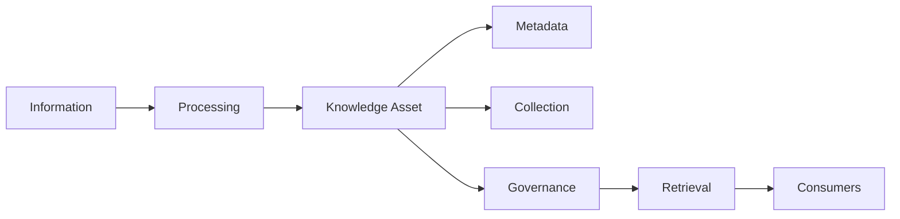

---
document:
  global_id: DOC-013
  capability_id: KNW-002

  title: KNOWLEDGE_CONCEPTUAL_ARCHITECTURE

  version: 1.0.0

  status: Draft

  owner: Enterprise Architecture Board

  release: ECOS v1.0

  capability: Knowledge

  category: Capability Architecture

  type: Conceptual Architecture

architecture:

  layer: Knowledge

  abstraction: Conceptual

  audience:

    - Enterprise Architects
    - AI Engineers
    - Knowledge Engineers
    - Platform Engineers

  maturity: Core

  reusable: true
---

# Knowledge Conceptual Architecture

---

# Executive Summary

The Knowledge Capability transforms raw enterprise information into governed, structured and semantically accessible organizational knowledge.

It provides the conceptual foundation that enables every cognitive capability inside ECOS to operate over trusted enterprise information.

The conceptual architecture intentionally avoids implementation details and focuses exclusively on business concepts, responsibilities and relationships.

---

# Purpose

The purpose of the Knowledge Capability is to establish a canonical enterprise knowledge domain capable of:

- acquiring information;
- transforming information into knowledge;
- governing knowledge assets;
- publishing trusted knowledge;
- enabling semantic retrieval.

---

# Conceptual Principles

The Knowledge Capability follows these principles:

1. Information becomes Knowledge only after governance.
2. Knowledge is immutable once published; updates create new versions.
3. Metadata is a first-class asset.
4. Retrieval is based on meaning, not only keywords.
5. Every knowledge asset has an owner.
6. Knowledge must be explainable and traceable.
7. The capability is independent of storage technology and AI models.

---

# Conceptual Domains

The capability is organized into the following conceptual domains:

## Knowledge Acquisition

Responsible for collecting information from internal and external sources.

Examples:

- Documents
- APIs
- Databases
- Wikis
- Source Code
- Email
- Audio
- Video

---

## Knowledge Processing

Transforms raw information into standardized knowledge.

Activities:

- Validation
- Cleaning
- Normalization
- Classification
- Language Detection
- Deduplication

---

## Knowledge Enrichment

Adds semantic value.

Activities:

- Metadata extraction
- Entity recognition
- Topic detection
- Taxonomy assignment
- Relationship discovery

---

## Knowledge Governance

Ensures quality and compliance.

Responsibilities:

- Ownership
- Versioning
- Retention
- Classification
- Approval workflows
- Access policies

---

## Knowledge Publishing

Makes knowledge available through governed interfaces.

Channels:

- Search
- APIs
- Events
- SDK
- Agent Platform

---

# Conceptual Knowledge Lifecycle

```text
Information

↓

Validation

↓

Normalization

↓

Classification

↓

Enrichment

↓

Governance

↓

Publication

↓

Consumption

↓

Continuous Improvement
```

---

# Conceptual Objects

The Knowledge Capability manages the following conceptual entities:

## Knowledge Asset

A governed unit of enterprise knowledge.

Examples:

- Policy
- Manual
- API Specification
- Technical Document
- Architecture Diagram
- Standard Operating Procedure

---

## Metadata

Describes a Knowledge Asset.

Examples:

- Title
- Owner
- Source
- Classification
- Version
- Language
- Tags
- Sensitivity
- Retention Policy

---

## Knowledge Collection

Logical grouping of related Knowledge Assets.

Examples:

- HR
- Finance
- Engineering
- Security
- Retail Operations

---

## Knowledge Consumer

Any internal or external service requesting knowledge.

Examples:

- Memory Capability
- Reasoning Capability
- Agent Platform
- RAE Platform

---

# Conceptual Relationships



---

# Responsibilities

The Knowledge Capability SHALL:

- provide trusted enterprise knowledge;
- expose semantic retrieval interfaces;
- maintain governance;
- preserve traceability;
- support versioning;
- enable interoperability.

The Knowledge Capability SHALL NOT:

- execute workflows;
- perform reasoning;
- maintain conversational memory;
- orchestrate agents;
- execute business logic.

---

# Architectural Boundaries

Owned by Knowledge:

- Knowledge Assets
- Metadata
- Taxonomy
- Semantic Indexes
- Retrieval Interfaces

Owned by other capabilities:

Memory → Conversation state

Reasoning → Decision making

Planning → Task planning

Execution → Action execution

---

# Conceptual Events

Representative lifecycle events:

- KnowledgeAcquired
- KnowledgeValidated
- KnowledgeClassified
- MetadataExtracted
- KnowledgePublished
- KnowledgeUpdated
- KnowledgeArchived

---

# Architecture Decisions

## ADR-KNW-002-001

Knowledge Assets are immutable after publication.

---

## ADR-KNW-002-002

Metadata is mandatory for every Knowledge Asset.

---

## ADR-KNW-002-003

Every Knowledge Asset belongs to exactly one primary owner.

---

## ADR-KNW-002-004

Retrieval interfaces expose governed abstractions only.

---

# Risks

- Knowledge duplication
- Poor metadata quality
- Inconsistent taxonomy
- Missing ownership
- Uncontrolled publication

---

# KPIs

- Knowledge Coverage
- Metadata Completeness
- Duplicate Detection Rate
- Average Retrieval Precision
- Knowledge Freshness
- Governance Compliance

---

# Success Criteria

The conceptual architecture is considered successful when:

- Every Knowledge Asset follows the canonical lifecycle.
- Metadata is complete and governed.
- Consumers retrieve trusted knowledge through standardized interfaces.
- Knowledge remains independent of implementation technologies.

---

# Dependencies

DOC-012 / KNW-001 — Knowledge Master Architecture

---

# Related Documents

KNW-003 — Knowledge Logical Architecture

KNW-004 — Knowledge Physical Architecture

KNW-005 — Knowledge Information Model

KNW-006 — Knowledge Metadata Model

---

# References

ECOS Foundation Specification

Enterprise Knowledge Management Principles

ISO/IEC 42010

TOGAF

C4 Model

---

# Approval

Status

Draft

Pending Enterprise Architecture Board Approval.
