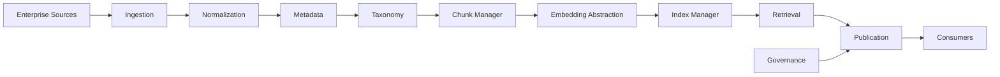

---
document:
  global_id: DOC-014
  capability_id: KNW-003

  title: KNOWLEDGE_LOGICAL_ARCHITECTURE

  version: 1.0.0

  status: Draft

  owner: Enterprise Architecture Board

  release: ECOS v1.0

  capability: Knowledge

  category: Capability Architecture

  type: Logical Architecture

architecture:

  layer: Knowledge

  abstraction: Logical

  audience:

    - Enterprise Architects
    - Solution Architects
    - AI Engineers
    - Platform Engineers

  maturity: Core

  reusable: true
---

# Knowledge Logical Architecture

---

# Executive Summary

The logical architecture defines the internal organization of the Knowledge Capability.

It specifies the logical services, responsibilities, interactions and information flows required to transform enterprise information into governed enterprise knowledge.

No technology choices are defined in this document.

---

# Purpose

This specification establishes:

- logical services;
- service responsibilities;
- communication patterns;
- dependency rules;
- logical boundaries;
- extensibility points.

---

# Design Principles

The logical architecture shall be:

- modular;
- stateless where possible;
- event-driven;
- service-oriented;
- vendor neutral;
- independently deployable.

---

# Logical Services

The Knowledge Capability is composed of the following logical services.

---

## Knowledge Ingestion Service

Responsibilities

- receive enterprise information;
- validate source format;
- identify source system;
- initiate processing pipeline.

Inputs

- documents;
- APIs;
- repositories;
- databases;
- media.

Outputs

- validated information packages.

---

## Normalization Service

Responsibilities

- normalize content;
- convert formats;
- detect language;
- remove duplicates;
- sanitize content.

Outputs

- normalized documents.

---

## Metadata Service

Responsibilities

- extract metadata;
- validate metadata;
- enrich metadata;
- classify metadata.

Produces

- metadata records.

---

## Taxonomy Service

Responsibilities

- assign categories;
- map ontology;
- classify domains;
- manage controlled vocabularies.

---

## Chunk Management Service

Responsibilities

- segment documents;
- preserve semantic context;
- assign chunk identifiers;
- maintain chunk relationships.

Rules

Chunks are logical objects, not storage objects.

---

## Embedding Abstraction Service

Responsibilities

- request embeddings;
- validate vectors;
- abstract embedding providers.

Important

The service SHALL NOT depend on a specific embedding model.

---

## Index Management Service

Responsibilities

- manage indexes;
- synchronize indexes;
- rebuild indexes;
- optimize retrieval.

---

## Retrieval Service

Responsibilities

- semantic search;
- hybrid search;
- ranking;
- filtering;
- contextual retrieval.

Consumers

Memory

Reasoning

Planning

Agent Platform

RAE Platform

---

## Knowledge Governance Service

Responsibilities

- ownership;
- retention;
- versioning;
- lifecycle;
- approval;
- audit.

---

## Publication Service

Responsibilities

- publish knowledge;
- expose APIs;
- generate events;
- notify consumers.

---

# Logical Component Diagram



---

# Canonical Processing Flow

```text
Acquire

↓

Validate

↓

Normalize

↓

Extract Metadata

↓

Classify

↓

Chunk

↓

Generate Embeddings

↓

Index

↓

Govern

↓

Publish

↓

Retrieve
```

---

# Logical Dependency Rules

Allowed

Ingestion

↓

Normalization

↓

Metadata

↓

Taxonomy

↓

Chunking

↓

Embedding

↓

Indexing

↓

Retrieval

↓

Publication

Forbidden

Reverse dependencies.

Circular dependencies.

Cross-service persistence access.

---

# Communication Model

Preferred communication

- Events
- Commands
- Queries
- APIs

Direct database sharing between services is prohibited.

---

# Extension Points

The architecture supports extensions for:

- ingestion connectors;
- metadata enrichers;
- embedding providers;
- search algorithms;
- ranking strategies;
- taxonomy providers;
- ontology engines.

Extensions shall implement official interfaces.

---

# Cross-Cutting Concerns

Every logical service supports:

- authentication;
- authorization;
- observability;
- audit;
- tracing;
- metrics;
- policy enforcement.

---

# Architecture Decisions

## ADR-KNW-003-001

Embedding generation is abstracted behind provider interfaces.

---

## ADR-KNW-003-002

Chunk Management is an independent service.

---

## ADR-KNW-003-003

Knowledge Governance owns lifecycle management.

---

## ADR-KNW-003-004

Retrieval never accesses sources directly.

---

## ADR-KNW-003-005

Publication is the only outbound interface.

---

# KPIs

- Average Ingestion Latency
- Metadata Accuracy
- Chunk Consistency
- Retrieval Precision
- Retrieval Recall
- Index Freshness
- Governance Compliance

---

# Risks

- Metadata inconsistency
- Chunk fragmentation
- Index drift
- Retrieval degradation
- Duplicate knowledge
- Poor taxonomy governance

---

# Success Criteria

The logical architecture is successful when:

Every service has a single responsibility.

Knowledge flows follow the canonical pipeline.

Consumers interact exclusively through Retrieval or Publication services.

Embedding providers remain replaceable.

No logical service owns responsibilities outside its domain.

---

# Dependencies

KNW-001 — Knowledge Master Architecture

KNW-002 — Knowledge Conceptual Architecture

---

# Related Documents

KNW-004 — Knowledge Physical Architecture

KNW-005 — Knowledge Information Model

KNW-006 — Knowledge Metadata Model

KNW-007 — Knowledge Chunk Model

KNW-008 — Knowledge Retrieval Architecture

---

# References

ECOS Foundation Specification

ISO/IEC 42010

TOGAF

C4 Model

Enterprise Integration Patterns

---

# Approval

Status

Draft

Pending Enterprise Architecture Board Approval.
