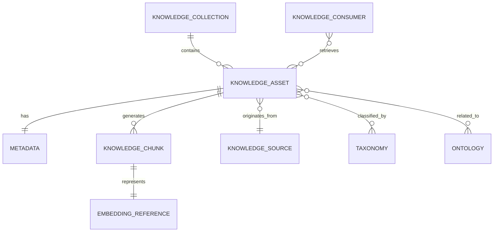

---
document:
  global_id: DOC-015

  capability_id: KNW-004

  title: KNOWLEDGE_INFORMATION_MODEL

  version: 1.0.0

  status: Draft

  owner: Enterprise Architecture Board

  release: ECOS v1.0

  capability: Knowledge

  category: Information Architecture

  type: Information Model

architecture:

  layer: Knowledge

  abstraction: Information

  audience:

    - Enterprise Architects

    - Data Architects

    - Knowledge Engineers

    - AI Engineers

  maturity: Core

  reusable: true
---

# Knowledge Information Model

---

# Executive Summary

The Knowledge Information Model defines the canonical information objects managed by the Knowledge Capability.

These objects represent business concepts rather than implementation details.

The model is independent of databases, storage engines, vector technologies and programming languages.

---

# Purpose

The Information Model establishes:

- enterprise information entities;
- ownership boundaries;
- relationships;
- lifecycle;
- semantic meaning;
- governance responsibilities.

---

# Information Model Principles

The model follows these principles:

- Technology independent.
- Immutable knowledge.
- Explicit ownership.
- Traceable lineage.
- Semantic consistency.
- Globally unique identifiers.
- Version-controlled assets.

---

# Core Information Objects

The Knowledge Capability is composed of the following canonical entities.

---

## Knowledge Asset

Definition

A governed unit of enterprise knowledge.

Examples

- Policy
- Manual
- Standard
- API Specification
- Architecture Document
- SOP
- Source Code
- Product Catalog
- Retail Promotion

Mandatory Attributes

- Asset ID
- Title
- Owner
- Source
- Version
- Language
- Classification
- Status
- Creation Date
- Last Review
- Retention Policy

---

## Knowledge Collection

Definition

Logical grouping of Knowledge Assets.

Examples

Engineering

Security

Retail

Finance

Human Resources

Relationships

One Collection contains many Assets.

---

## Metadata Record

Definition

Structured descriptive information associated with a Knowledge Asset.

Examples

- Tags
- Keywords
- Topics
- Categories
- Authors
- Business Unit
- Security Classification
- Geographic Scope

---

## Knowledge Chunk

Definition

The smallest retrievable semantic unit generated from a Knowledge Asset.

Characteristics

- belongs to exactly one Knowledge Asset;
- has semantic continuity;
- maintains lineage;
- contains independent metadata.

---

## Embedding Reference

Definition

Logical representation of the semantic vector associated with a Chunk.

Important

The Information Model does not define vector dimensions or storage technology.

---

## Taxonomy

Definition

Controlled hierarchical classification.

Examples

Retail

↓

Operations

↓

Pricing

↓

Promotions

---

## Ontology

Definition

Formal semantic relationships between enterprise concepts.

Examples

Customer

purchases

Product

Store

belongs_to

Region

Promotion

targets

Customer Segment

---

## Knowledge Source

Definition

Origin of enterprise information.

Examples

ERP

CRM

SharePoint

GitHub

Notion

API

Email

Documents

---

## Knowledge Consumer

Definition

Authorized service consuming enterprise knowledge.

Examples

Memory

Reasoning

Planning

Execution

Agent Platform

RAE Platform

---

# Information Relationships

---

# Information Lifecycle

Knowledge Source

↓

Knowledge Asset

↓

Metadata

↓

Chunk

↓

Embedding Reference

↓

Indexed Knowledge

↓

Retrieval

↓

Archive

---

# Ownership Rules

Every entity SHALL have:

- Owner
- Lifecycle
- Version
- Audit History
- Security Classification

---

# Identity Rules

Every object SHALL possess:

- Global Identifier
- Stable Identifier
- Immutable Identifier

Identifiers SHALL never be reused.

---

# Versioning

Knowledge Assets

Semantic Versioning

Metadata

Independent version history

Chunks

Derived versions

Embedding References

Regenerated independently

---

# Information Constraints

Knowledge Assets cannot exist without:

- Owner
- Metadata
- Source
- Classification

Chunks cannot exist without a parent Asset.

Embedding References cannot exist without a Chunk.

---

# Architecture Decisions

## ADR-KNW-004-001

Knowledge Assets are the canonical enterprise information object.

---

## ADR-KNW-004-002

Chunks are derived objects.

---

## ADR-KNW-004-003

Embedding References remain technology independent.

---

## ADR-KNW-004-004

Metadata is mandatory for every enterprise knowledge object.

---

# KPIs

Knowledge Coverage

Metadata Completeness

Asset Freshness

Duplicate Rate

Chunk Consistency

Ontology Coverage

Taxonomy Completeness

---

# Risks

Metadata degradation

Taxonomy inconsistency

Broken lineage

Knowledge duplication

Orphan chunks

Ontology drift

---

# Success Criteria

The Information Model is successful when:

Every enterprise knowledge object conforms to this specification.

Information lineage remains complete.

Knowledge Assets are uniquely identifiable.

Semantic retrieval remains independent of storage technologies.

---

# Dependencies

KNW-001

KNW-002

KNW-003

---

# Related Documents

KNW-005 Metadata Model

KNW-006 Chunk Model

KNW-007 Retrieval Architecture

KNW-008 Vector Abstraction

---

# References

ISO/IEC 11179

TOGAF

ISO/IEC 42010

Enterprise Knowledge Management

---

# Approval

Status

Draft

Pending Enterprise Architecture Board Approval.
