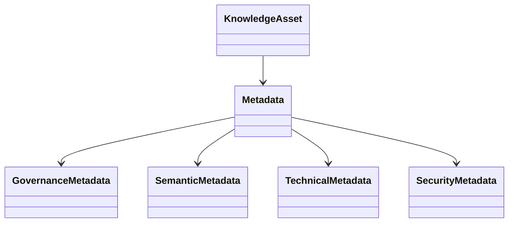

---
document:
  global_id: DOC-016
  capability_id: KNW-005

  title: KNOWLEDGE_METADATA_MODEL

  version: 1.0.0

  status: Draft

  owner: Enterprise Architecture Board

  release: ECOS v1.0

  capability: Knowledge

  category: Information Architecture

  type: Metadata Model

architecture:

  layer: Knowledge

  abstraction: Information

  audience:

    - Data Architects
    - Knowledge Engineers
    - AI Engineers
    - Enterprise Architects

  reusable: true

  maturity: Core
---

# Knowledge Metadata Model

---

# Executive Summary

Metadata is treated as a first-class enterprise asset.

Within ECOS, metadata is not an accessory to knowledge—it is the mechanism that enables governance, retrieval, explainability, lineage and lifecycle management.

Every Knowledge Asset SHALL possess metadata.

---

# Purpose

The Metadata Model defines:

- mandatory metadata;
- optional metadata;
- semantic metadata;
- governance metadata;
- operational metadata;
- security metadata;
- lineage metadata.

---

# Design Principles

Metadata shall be:

- complete;
- machine-readable;
- human-readable;
- versioned;
- immutable once published;
- extensible;
- searchable.

---

# Metadata Categories

## Identity Metadata

Purpose

Uniquely identify the asset.

Mandatory Fields

- Asset ID
- UUID
- Canonical URI
- Version
- Title

---

## Ownership Metadata

Mandatory Fields

- Owner
- Business Unit
- Steward
- Maintainer
- Contact

---

## Source Metadata

Mandatory Fields

- Source System
- Source URI
- Import Date
- Acquisition Method
- Connector

---

## Classification Metadata

Mandatory Fields

- Domain
- Category
- Subcategory
- Tags
- Topics
- Language

---

## Governance Metadata

Mandatory Fields

- Lifecycle State
- Approval Status
- Retention Policy
- Review Cycle
- Compliance Labels

---

## Security Metadata

Mandatory Fields

- Confidentiality
- Integrity
- Availability
- Sensitivity
- Access Policy

---

## Semantic Metadata

Mandatory Fields

- Entities
- Concepts
- Keywords
- Ontology Links
- Taxonomy References

---

## Technical Metadata

Mandatory Fields

- MIME Type
- Character Encoding
- File Size
- Checksum
- Parser Version

---

## Operational Metadata

Mandatory Fields

- Last Indexed
- Last Retrieved
- Retrieval Count
- Freshness Score
- Processing Duration

---

## AI Metadata

Mandatory Fields

- Embedding Version
- Chunk Strategy
- Chunk Count
- Model Compatibility
- Context Score

---

# Metadata Relationships

---

# Metadata Lifecycle

Create

↓

Validate

↓

Enrich

↓

Approve

↓

Publish

↓

Update

↓

Archive

---

# Metadata Quality Rules

Metadata SHALL satisfy:

- Completeness
- Accuracy
- Consistency
- Timeliness
- Validity
- Uniqueness

---

# Metadata Versioning

Every metadata update SHALL:

- preserve history;
- create a new metadata version;
- maintain audit records;
- preserve lineage.

---

# Metadata Constraints

Metadata SHALL NEVER:

- reference non-existent assets;
- contain duplicate identifiers;
- violate taxonomy;
- violate ontology constraints;
- omit mandatory fields.

---

# Metadata Consumers

- Retrieval Engine
- Search Engine
- Memory Capability
- Reasoning Capability
- Planning Capability
- Governance Engine
- Agent Platform

---

# Architecture Decisions

## ADR-KNW-005-001

Metadata is mandatory.

---

## ADR-KNW-005-002

Metadata evolves independently from asset content.

---

## ADR-KNW-005-003

Metadata lineage is permanent.

---

## ADR-KNW-005-004

Semantic metadata shall remain provider independent.

---

# KPIs

Metadata Completeness

Metadata Accuracy

Metadata Freshness

Metadata Coverage

Semantic Enrichment Rate

Validation Success Rate

---

# Risks

Missing metadata

Inconsistent taxonomy

Broken lineage

Semantic degradation

Outdated metadata

---

# Success Criteria

The Metadata Model is successful when:

Every Knowledge Asset contains complete metadata.

Metadata supports enterprise governance.

Semantic retrieval benefits from enriched metadata.

Metadata remains independent of storage technologies.

---

# Dependencies

KNW-001

KNW-002

KNW-003

KNW-004

---

# Related Documents

KNW-006 Chunk Model

KNW-007 Retrieval Model

KNW-008 Vector Abstraction

---

# References

ISO/IEC 11179

Dublin Core Metadata Initiative

ISO 23081

TOGAF

Enterprise Metadata Management

---

# Approval

Status

Draft

Pending Enterprise Architecture Board Approval.
