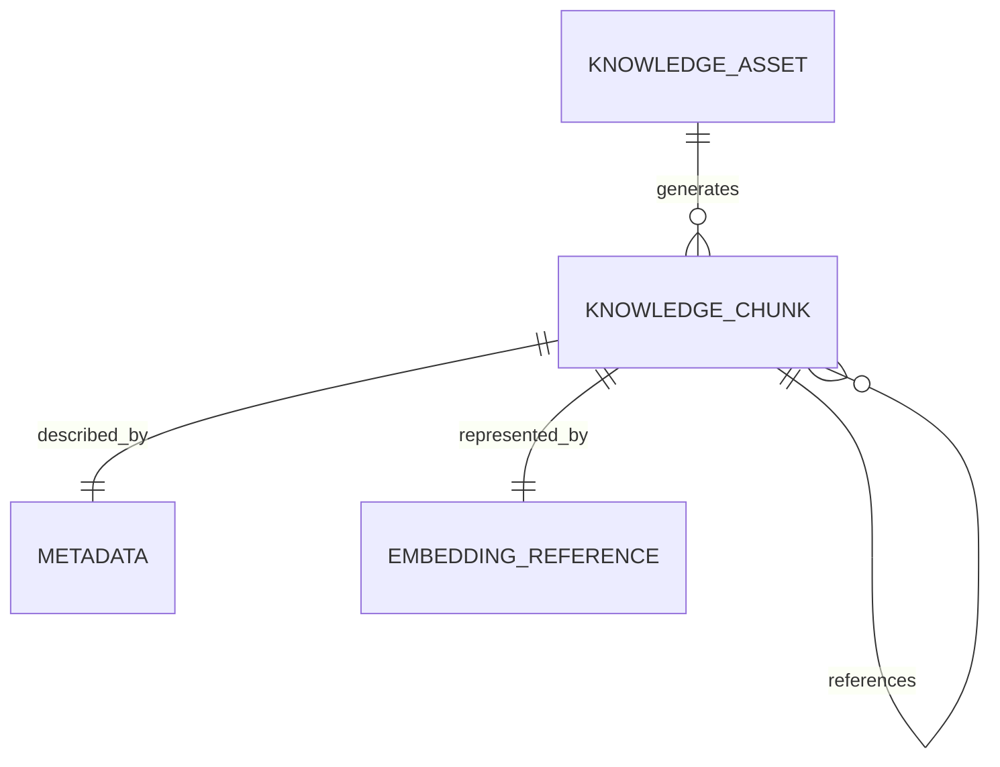

---
document:
  global_id: DOC-017
  capability_id: KNW-006

  title: KNOWLEDGE_CHUNK_MODEL

  version: 1.0.0

  status: Draft

  owner: Enterprise Architecture Board

  release: ECOS v1.0

  capability: Knowledge

  category: Information Architecture

  type: Chunk Model

architecture:

  layer: Knowledge

  abstraction: Information

  audience:

    - Knowledge Engineers
    - AI Engineers
    - Enterprise Architects
    - Data Architects

  reusable: true

  maturity: Core
---

# Knowledge Chunk Model

---

# Executive Summary

A Knowledge Chunk is the smallest independently retrievable semantic unit within the ECOS Knowledge Capability.

Unlike traditional text chunking approaches, ECOS defines a Chunk as a semantic knowledge object rather than a simple text fragment.

Chunks preserve meaning, context and lineage while remaining technology independent.

---

# Purpose

The Chunk Model defines:

- semantic chunk boundaries;
- chunk lifecycle;
- chunk identity;
- parent-child relationships;
- chunk metadata;
- chunk governance;
- retrieval responsibilities.

---

# Design Principles

Every Chunk SHALL be:

- semantically coherent;
- independently retrievable;
- uniquely identifiable;
- traceable;
- versioned;
- immutable after publication;
- linked to its originating Knowledge Asset.

---

# Definition

A Knowledge Chunk represents one complete semantic idea extracted from a Knowledge Asset.

A Chunk SHALL never be defined solely by character count or token count.

Semantic integrity has priority over size.

---

# Sources

Chunks may originate from:

- Documents
- Source Code
- APIs
- Database Records
- Emails
- Chat Conversations
- OCR
- Images
- Audio Transcriptions
- Video Transcriptions
- Structured Data
- Markdown
- HTML
- JSON
- XML

---

# Chunk Components

Every Chunk SHALL contain:

## Identity

- Chunk ID
- UUID
- Parent Asset ID
- Version

---

## Content

- Canonical Content
- Original Language
- Normalized Representation

---

## Semantic Context

- Summary
- Main Topic
- Related Concepts
- Named Entities
- Keywords

---

## Structural Context

- Parent Section
- Document Position
- Previous Chunk
- Next Chunk
- Hierarchical Level

---

## Governance

- Owner
- Classification
- Retention Policy
- Lifecycle State
- Approval Status

---

## Retrieval Attributes

- Retrieval Score
- Freshness Score
- Confidence Score
- Relevance Signals

---

# Chunk Relationships

---

# Chunk Lifecycle

Knowledge Asset

↓

Chunk Creation

↓

Validation

↓

Semantic Analysis

↓

Metadata Enrichment

↓

Embedding Generation

↓

Publication

↓

Retrieval

↓

Archive

---

# Chunk Quality Rules

A Chunk SHALL:

- express one primary idea;
- preserve semantic continuity;
- avoid unnecessary duplication;
- maintain parent lineage;
- support contextual reconstruction.

---

# Chunk Constraints

Chunks SHALL NOT:

- exist without a parent Knowledge Asset;
- lose semantic meaning when retrieved independently;
- contain orphan metadata;
- break lineage relationships.

---

# Chunk Types

Supported logical types include:

- Narrative Chunk
- Procedure Chunk
- Policy Chunk
- API Chunk
- Code Chunk
- FAQ Chunk
- Conversation Chunk
- Table Chunk
- Configuration Chunk
- Event Chunk

---

# Chunk Versioning

Every Chunk SHALL maintain:

- immutable identifier;
- version history;
- parent asset version;
- embedding version reference.

---

# Chunk Lineage

The complete lineage SHALL include:

Knowledge Source

↓

Knowledge Asset

↓

Knowledge Chunk

↓

Embedding Reference

↓

Retrieval Event

↓

Consumer

---

# Architecture Decisions

## ADR-KNW-006-001

Chunks are semantic objects.

---

## ADR-KNW-006-002

Chunk size is subordinate to semantic integrity.

---

## ADR-KNW-006-003

Chunks preserve complete lineage.

---

## ADR-KNW-006-004

Chunks are immutable after publication.

---

# KPIs

Average Chunk Quality

Semantic Integrity Score

Chunk Reuse Rate

Chunk Freshness

Retrieval Precision

Context Preservation

---

# Risks

Oversized chunks

Fragmented concepts

Lost lineage

Duplicate chunks

Semantic drift

---

# Success Criteria

The Chunk Model is successful when:

Every Chunk represents a coherent semantic concept.

Chunks remain independently retrievable.

Semantic integrity is preserved across retrieval operations.

Lineage remains complete and auditable.

---

# Dependencies

KNW-001

KNW-002

KNW-003

KNW-004

KNW-005

---

# Related Documents

KNW-007 Retrieval Model

KNW-008 Vector Abstraction

KNW-009 Knowledge Graph

---

# References

Enterprise Knowledge Management

ISO/IEC 42010

RAG Best Practices

Semantic Information Theory

Knowledge Representation Principles

---

# Approval

Status

Draft

Pending Enterprise Architecture Board Approval.
