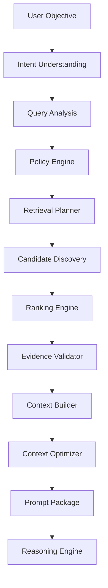
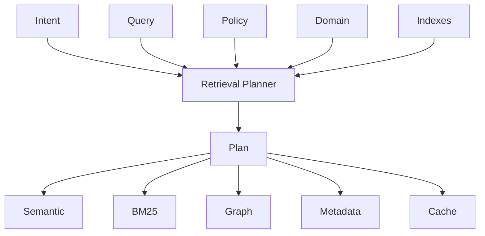
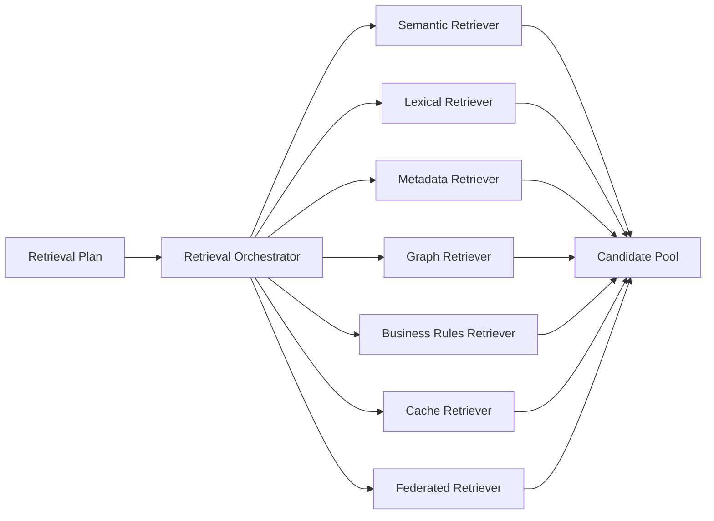
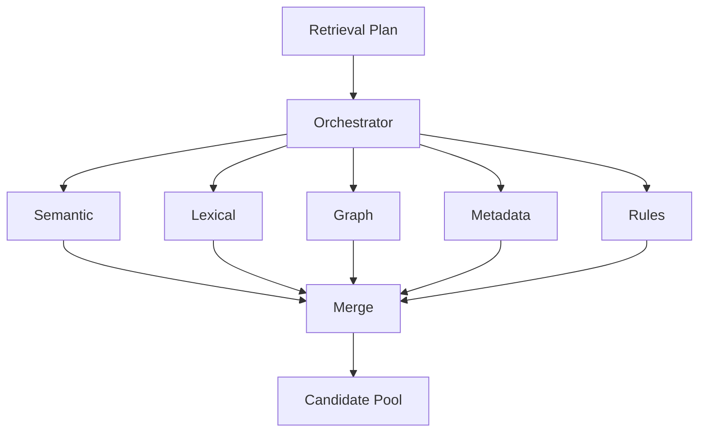
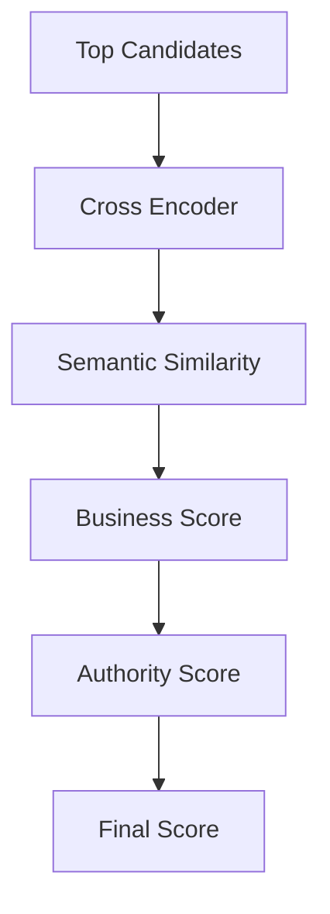
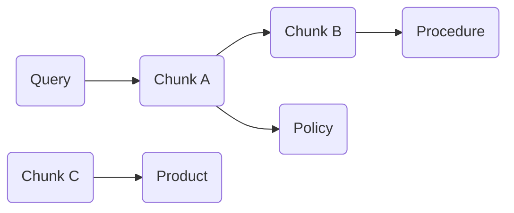
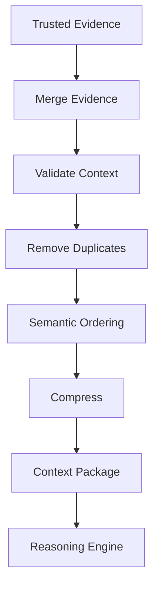
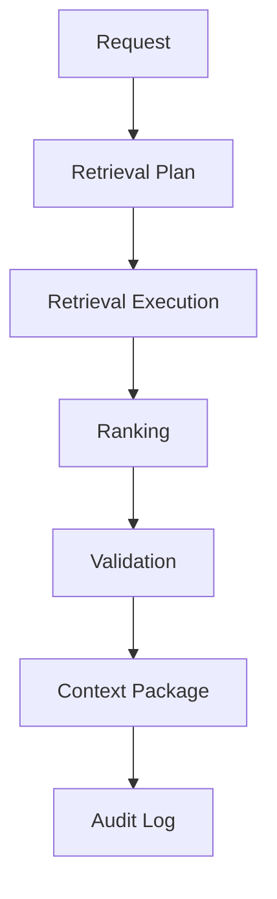
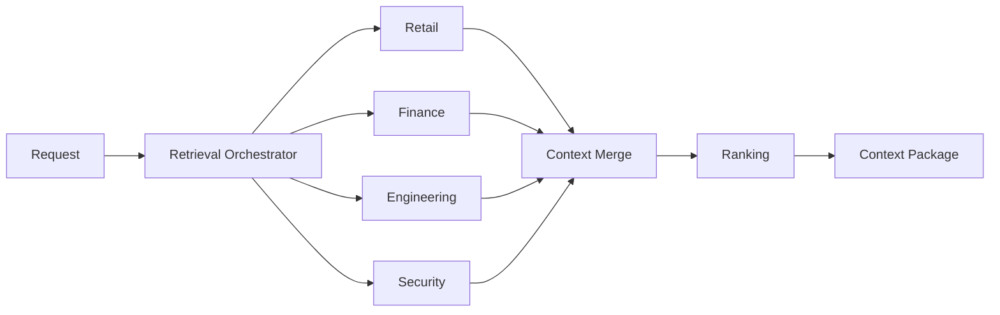

---
document:
  global_id: DOC-018
  capability_id: KNW-007

  title: KNOWLEDGE_RETRIEVAL_ARCHITECTURE

  version: 1.0.0

  status: Draft

  owner: Enterprise Architecture Board

  release: ECOS v1.0

  capability: Knowledge

  category: Capability Architecture

  type: Enterprise Retrieval Architecture

architecture:

  layer: Knowledge

  abstraction: Retrieval

  maturity: Enterprise

  reusable: true

  ai_native: true

  vendor_neutral: true

  implementation_independent: true
---

# Knowledge Retrieval Architecture

## Enterprise Reference Specification

---

# Executive Summary

The Retrieval Capability is the intelligence responsible for discovering, selecting, validating, ranking and assembling enterprise knowledge before it is consumed by downstream cognitive capabilities.

Within ECOS, Retrieval is not considered a database query nor a vector search.

Retrieval is a complete cognitive capability whose objective is to transform enterprise knowledge into trusted contextual evidence.

The Retrieval Capability provides context to:

- Memory
- Reasoning
- Planning
- Execution
- Agent Platform
- Future Cognitive Capabilities

Every AI decision produced by ECOS depends on Retrieval quality.

Therefore Retrieval is treated as a first-class enterprise capability.

---

# Mission

Deliver the most relevant, trustworthy, explainable and policy-compliant knowledge required to solve a user objective.

---

# Vision

Provide the world's most extensible enterprise retrieval architecture capable of combining semantic understanding, lexical search, knowledge graphs, governance policies and business intelligence into a unified context generation engine.

---

# Why Retrieval Exists

Large Language Models do not possess authoritative enterprise knowledge.

Knowledge resides inside organizations.

Retrieval bridges the gap between enterprise knowledge and artificial intelligence.

Without Retrieval:

- responses hallucinate
- policies are ignored
- outdated information is used
- business rules disappear
- governance cannot exist

Retrieval converts enterprise knowledge into AI context.

---

# Core Philosophy

ECOS Retrieval is NOT:

- Vector Search
- Database Search
- Keyword Search
- SQL Query
- Embedding Lookup

ECOS Retrieval IS:

An enterprise process that constructs trusted contextual evidence.

---

# Enterprise Objectives

The Retrieval Capability SHALL:

- maximize relevance
- minimize hallucination
- preserve governance
- respect security
- provide explainability
- remain vendor independent
- support hybrid retrieval
- optimize latency
- maximize context quality
- preserve semantic integrity

---

# Design Principles

## Principle 1

Context before Generation.

Generation never occurs before Retrieval.

---

## Principle 2

Meaning before Similarity.

Semantic understanding has priority over vector distance.

---

## Principle 3

Evidence before Confidence.

Answers require evidence.

Confidence without evidence has no architectural value.

---

## Principle 4

Governance before Retrieval.

Knowledge violating policy SHALL never be retrieved.

---

## Principle 5

Context over Documents.

The consumer never requests documents.

The consumer requests contextual evidence.

---

## Principle 6

Multiple Retrieval Strategies.

No single retrieval algorithm solves every problem.

---

## Principle 7

Retrieval is Observable.

Every retrieval decision shall be explainable.

---

# Capability Responsibilities

The Retrieval Capability owns:

- Query Analysis
- Intent Detection
- Query Expansion
- Retrieval Planning
- Candidate Discovery
- Candidate Ranking
- Evidence Validation
- Context Assembly
- Context Optimization
- Retrieval Metrics
- Retrieval Observability
- Retrieval Governance

---

# Capability Boundaries

Owned

✓ Retrieval

✓ Ranking

✓ Context

✓ Evidence

✓ Policies

✓ Retrieval Metrics

Not Owned

✗ Knowledge Ingestion

✗ Chunk Generation

✗ Metadata Creation

✗ Embedding Generation

✗ Memory

✗ Reasoning

✗ Planning

✗ Prompt Execution

---

# Enterprise Retrieval Pipeline

```text
User Objective

↓

Intent Analysis

↓

Query Understanding

↓

Policy Evaluation

↓

Retrieval Planning

↓

Candidate Generation

↓

Candidate Validation

↓

Ranking

↓

Re-ranking

↓

Evidence Validation

↓

Context Assembly

↓

Context Compression

↓

Prompt Package

↓

Consumer
```

---

# Retrieval High-Level Architecture



---

# Retrieval Lifecycle

Every retrieval request follows a deterministic lifecycle.

Stage 1

Receive User Objective

↓

Stage 2

Understand User Intent

↓

Stage 3

Identify Knowledge Domains

↓

Stage 4

Evaluate Security Policies

↓

Stage 5

Select Retrieval Strategies

↓

Stage 6

Collect Candidates

↓

Stage 7

Rank Candidates

↓

Stage 8

Validate Evidence

↓

Stage 9

Assemble Context

↓

Stage 10

Compress Context

↓

Stage 11

Deliver Context Package

---

# Enterprise Retrieval Components

The Retrieval Capability is composed of the following logical engines:

- Intent Engine
- Query Analyzer
- Policy Engine
- Retrieval Planner
- Candidate Discovery Engine
- Hybrid Search Engine
- Semantic Retrieval Engine
- Lexical Retrieval Engine
- Knowledge Graph Retriever
- Metadata Retriever
- Business Rules Retriever
- Ranking Engine
- Re-ranking Engine
- Evidence Validator
- Context Builder
- Context Optimizer
- Prompt Package Builder
- Metrics Engine
- Audit Engine
- Observability Engine

---

# Architecture Decision Records

## ADR-KNW-007-001

Retrieval SHALL be implemented as an independent enterprise capability.

---

## ADR-KNW-007-002

Retrieval SHALL return contextual evidence instead of documents.

---

## ADR-KNW-007-003

Multiple retrieval strategies SHALL coexist.

---

## ADR-KNW-007-004

Vector similarity SHALL NEVER be the only ranking criterion.

---

## ADR-KNW-007-005

Every retrieval decision SHALL be explainable.

---

# Dependencies

KNW-001

KNW-002

KNW-003

KNW-004

KNW-005

KNW-006

---

# Related Documents

KNW-008 Knowledge Vector Abstraction

KNW-009 Knowledge Graph Architecture

---

# Approval

Status

Draft

Pending Enterprise Architecture Board Approval.

---

# Part 2 — Intent Understanding & Retrieval Planning

---

# Executive Summary

The first responsibility of the Retrieval Capability is not searching.

Its first responsibility is understanding.

Searching before understanding introduces unnecessary ambiguity, poor relevance and low-quality contextual evidence.

The Retrieval Capability SHALL understand the user's objective before selecting any retrieval strategy.

---

# Canonical Retrieval Flow

```text
User Request

↓

Intent Understanding

↓

Query Analysis

↓

Context Expansion

↓

Policy Evaluation

↓

Retrieval Planning

↓

Candidate Discovery

...
```

Understanding precedes Retrieval.

---

# Intent Understanding Engine

## Purpose

The Intent Understanding Engine identifies the actual objective behind a request.

The objective is not keyword extraction.

The objective is semantic understanding.

---

## Responsibilities

The engine SHALL:

- detect intent
- identify requested knowledge
- classify business domain
- identify requested entities
- determine expected output
- identify urgency
- detect ambiguity
- detect missing context
- determine confidence

---

## Input

Natural language request

API request

Agent request

Workflow request

System event

---

## Output

Intent Object

---

Example

```yaml
intent:

  id: intent-001

  type: Knowledge Lookup

  domain: Retail

  goal: Find Promotion Policy

  confidence: 0.97

  requires_context: true

  priority: High
```

---

# Intent Categories

Supported enterprise intents include:

- Knowledge Lookup
- Policy Lookup
- Procedure Lookup
- API Discovery
- Code Search
- Document Search
- FAQ
- Compliance Verification
- Architecture Search
- Configuration Search
- Historical Search
- Comparative Search
- Decision Support
- Recommendation
- Root Cause Investigation
- Context Completion

Future versions may introduce additional intent categories.

---

# Intent Detection Pipeline


---

# Query Analyzer

## Purpose

Transform the original request into a structured enterprise query.

---

## Responsibilities

The Query Analyzer SHALL:

- normalize language
- remove ambiguity
- identify concepts
- extract entities
- identify dates
- identify products
- identify customers
- identify locations
- identify business units
- identify technical terminology
- detect filters
- identify exclusions
- generate semantic representation

---

# Example

User

> Show the latest pricing policy for supermarkets in Bogotá.

Query Object

```yaml
query:

  type: Policy

  entity: Pricing Policy

  filters:

    city: Bogotá

    business: Retail

    time: Latest

  language: Spanish
```

---

# Ambiguity Resolution

If ambiguity exists the Retrieval Engine SHALL:

- identify ambiguity
- estimate confidence
- attempt contextual disambiguation
- request clarification when necessary

---

Example

User

> Show promotions.

Ambiguous.

Possible meanings

- Retail promotions
- Marketing campaigns
- Discount policies
- Historical promotions
- Upcoming promotions

Retrieval SHALL NOT assume.

---

# Context Expansion

Purpose

Expand the user's request using enterprise knowledge.

Example

User

> Chicken promotion

Expanded Context

Chicken

↓

Meat

↓

Fresh Food

↓

Perishable Products

↓

Retail Promotions

↓

Current Campaign

↓

Regional Availability

Context expansion improves retrieval quality.

---

# Enterprise Context Sources

Expansion may use:

- Taxonomy
- Ontology
- Knowledge Graph
- Metadata
- Business Rules
- Historical Usage
- User Profile
- Conversation Context
- Previous Retrievals
- Domain Vocabulary

---

# Query Enrichment

Every query SHALL be enriched with:

- semantic concepts
- enterprise taxonomy
- ontology references
- business vocabulary
- known aliases
- abbreviations
- language normalization
- organizational terminology

---

# Retrieval Planning

Purpose

Determine the optimal retrieval strategy.

Retrieval planning occurs before any search operation.

---

## Responsibilities

The planner SHALL decide:

- Which retrievers execute.
- Execution order.
- Parallel execution.
- Fallback strategies.
- Ranking strategy.
- Compression strategy.
- Evidence validation strategy.

---

# Retrieval Planner Inputs

- Intent
- Query
- Policies
- Metadata
- Available indexes
- Knowledge domains
- User permissions
- Latency objectives

---

# Planner Outputs

Retrieval Plan

Example

```yaml
plan:

  semantic_search: true

  bm25: true

  knowledge_graph: false

  metadata_filter: true

  reranking: true

  compression: adaptive

  top_k: 40

  final_context: 12
```

---

# Retrieval Strategies

The planner supports:

- Semantic Retrieval
- Lexical Retrieval
- Metadata Retrieval
- Graph Retrieval
- Rule-Based Retrieval
- Hybrid Retrieval
- Federated Retrieval
- Cache Retrieval
- Hierarchical Retrieval
- Adaptive Retrieval

---

# Strategy Selection Rules

Example

Policy Search

↓

Metadata

↓

Semantic

↓

Business Rules

---

API Search

↓

Lexical

↓

Metadata

↓

Semantic

---

Architecture Search

↓

Semantic

↓

Knowledge Graph

↓

Metadata

---

Historical Search

↓

Metadata

↓

Time Filter

↓

Semantic

---

# Adaptive Planning

The Retrieval Planner SHALL adapt according to:

- intent
- knowledge domain
- latency budget
- context size
- confidence
- retrieval history
- available indexes
- security restrictions

---

# Planner Diagram



---

# Failure Handling

If planning fails:

- fallback planner
- safe retrieval
- minimal retrieval
- cached retrieval
- request clarification
- never generate unsupported context

---

# Architecture Decisions (Part 2)

## ADR-KNW-007-006

Understanding precedes Retrieval.

---

## ADR-KNW-007-007

Intent determines strategy.

---

## ADR-KNW-007-008

Planning is deterministic.

---

## ADR-KNW-007-009

Query enrichment SHALL preserve semantic meaning.

---

## ADR-KNW-007-010

Retrieval strategies SHALL remain replaceable.

---

# KPIs (Part 2)

Intent Detection Accuracy

Planner Accuracy

Average Planning Latency

Query Enrichment Coverage

Context Expansion Effectiveness

Ambiguity Resolution Rate

---

# Part 3 — Candidate Discovery & Multi-Strategy Retrieval

---

# Executive Summary

After the Retrieval Planner produces the Retrieval Plan, execution begins.

The objective is not to retrieve documents.

The objective is to discover the highest quality evidence available across the enterprise.

Evidence may originate from multiple heterogeneous knowledge systems.

The Retrieval Engine SHALL coordinate all retrieval mechanisms without exposing implementation complexity to downstream consumers.

---

# Retrieval Execution Model

Retrieval execution follows this canonical sequence:

```text
Retrieval Plan

↓

Candidate Discovery

↓

Parallel Retrieval

↓

Evidence Collection

↓

Evidence Normalization

↓

Candidate Pool

↓

Ranking
```

---

# Retrieval Orchestrator

## Purpose

The Retrieval Orchestrator coordinates every retrieval strategy.

It is responsible for:

- launching retrievers;
- managing execution order;
- controlling concurrency;
- enforcing latency budgets;
- collecting evidence;
- handling failures;
- producing the Candidate Pool.

The Orchestrator SHALL NOT implement search algorithms directly.

---

## Orchestrator Responsibilities

The Orchestrator SHALL:

- execute retrieval plans;
- invoke retrievers;
- manage parallel execution;
- merge results;
- remove duplicates;
- preserve evidence lineage;
- enforce governance policies;
- collect execution metrics.

---

# Candidate Discovery

## Definition

Candidate Discovery is the process of locating every potentially relevant Knowledge Chunk before ranking occurs.

Discovery favors recall.

Ranking favors precision.

These concerns SHALL remain independent.

---

# Candidate Discovery Sources

The Discovery Engine may retrieve candidates from:

- Semantic Index
- Lexical Index
- Metadata Index
- Knowledge Graph
- Business Rules Repository
- Frequently Accessed Cache
- Conversation Context
- External Enterprise Connectors
- Federated Knowledge Domains
- Archived Knowledge

---

# Retrieval Execution Diagram



---

# Semantic Retriever

## Purpose

Discover semantically related Knowledge Chunks.

The Semantic Retriever SHALL:

- operate over semantic representations;
- understand conceptual similarity;
- support multilingual retrieval;
- preserve semantic integrity;
- remain provider independent.

Inputs

- semantic query;
- embedding reference;
- retrieval filters.

Outputs

Candidate Chunks.

---

# Lexical Retriever

## Purpose

Retrieve exact textual evidence.

Typical use cases:

- API names
- configuration files
- product codes
- SKUs
- error messages
- log identifiers
- version numbers
- source code

Lexical retrieval complements semantic retrieval.

It does not replace it.

---

# Metadata Retriever

## Purpose

Retrieve evidence using metadata instead of content.

Supported filters include:

- owner;
- business unit;
- language;
- creation date;
- classification;
- lifecycle;
- tags;
- document type;
- geographic region.

---

# Knowledge Graph Retriever

## Purpose

Navigate relationships between enterprise concepts.

Instead of similarity, Graph Retrieval explores:

- dependencies;
- hierarchies;
- ownership;
- references;
- semantic relations.

Example

Promotion

↓

Store

↓

Region

↓

Campaign

↓

Supplier

↓

Product

---

# Business Rules Retriever

## Purpose

Retrieve governed business rules.

Examples:

- Pricing rules
- Compliance rules
- Security rules
- Retention policies
- Operational procedures

Business rules SHALL always override statistical relevance when required by policy.

---

# Cache Retriever

Purpose

Reuse previously validated contextual evidence.

Supported cache levels:

L1 — Request Cache

L2 — Conversation Cache

L3 — Session Cache

L4 — Enterprise Retrieval Cache

Cache SHALL never bypass governance validation.

---

# Federated Retriever

Purpose

Retrieve knowledge from multiple enterprise domains.

Examples

- HR
- Finance
- Retail
- Engineering
- Legal
- Security
- Partners
- Cloud Services

Each domain remains autonomous.

Retrieval remains unified.

---

# Retrieval Parallelism

Multiple retrievers SHALL execute simultaneously whenever possible.



---

# Candidate Pool

Definition

The Candidate Pool contains every potential evidence object before ranking.

Candidate objects SHALL include:

- Chunk ID
- Asset ID
- Source
- Retriever Origin
- Preliminary Score
- Confidence
- Metadata
- Lineage Reference

---

# Duplicate Detection

Before ranking, duplicates SHALL be removed.

Duplicate detection considers:

- semantic similarity;
- identical assets;
- overlapping chunks;
- canonical identifiers;
- document versions.

---

# Candidate Normalization

Every candidate SHALL be normalized into the canonical ECOS Retrieval Candidate model.

Required fields:

- Candidate ID
- Knowledge Asset
- Chunk Reference
- Retriever Source
- Preliminary Score
- Metadata
- Evidence Type
- Confidence
- Timestamp

---

# Latency Budget

Every retriever SHALL respect execution budgets.

Example

Semantic Retriever ≤ 150 ms

Lexical Retriever ≤ 50 ms

Metadata Retriever ≤ 30 ms

Cache Retriever ≤ 10 ms

The Orchestrator MAY terminate slow retrievers if the latency budget is exceeded.

---

# Failure Strategy

Retriever failures SHALL NOT terminate retrieval.

Instead:

- log failure;
- continue with remaining retrievers;
- adjust confidence;
- record missing evidence.

---

# Architecture Decisions (Part 3)

## ADR-KNW-007-011

Retrieval SHALL use multiple specialized retrievers.

---

## ADR-KNW-007-012

Candidate Discovery maximizes recall.

---

## ADR-KNW-007-013

Ranking SHALL occur only after Candidate Pool construction.

---

## ADR-KNW-007-014

Every candidate SHALL preserve lineage.

---

## ADR-KNW-007-015

Retriever implementations remain independently replaceable.

---

# KPIs (Part 3)

Candidate Recall

Retriever Latency

Duplicate Detection Rate

Candidate Coverage

Retriever Availability

Federated Retrieval Success

Parallel Execution Efficiency

---

# Part 4 — Ranking Engine & Evidence Validation

---

# Executive Summary

Candidate Discovery maximizes recall.

Ranking maximizes precision.

Evidence Validation maximizes trust.

These three responsibilities SHALL remain independent.

The objective of Ranking is not selecting the most similar Chunk.

The objective is selecting the most trustworthy enterprise evidence.

---

# Enterprise Ranking Philosophy

Ranking SHALL evaluate knowledge using multiple dimensions.

Similarity alone SHALL NEVER determine final ordering.

Enterprise knowledge requires additional evaluation including governance, authority, freshness, provenance and business relevance.

---

# Canonical Ranking Pipeline

```text
Candidate Pool

↓

Candidate Normalization

↓

Policy Filtering

↓

Quality Evaluation

↓

Semantic Ranking

↓

Business Ranking

↓

Authority Evaluation

↓

Freshness Evaluation

↓

Evidence Validation

↓

Conflict Resolution

↓

Final Ranking

↓

Trusted Evidence Set
```

---

# Ranking Engine

## Purpose

The Ranking Engine assigns a composite score to every candidate based on multiple independent evaluation dimensions.

---

## Responsibilities

The Ranking Engine SHALL:

- evaluate semantic relevance;
- evaluate lexical relevance;
- evaluate metadata quality;
- evaluate business importance;
- evaluate authority;
- evaluate freshness;
- evaluate confidence;
- generate explainable scores.

---

# Ranking Factors

Every candidate SHALL receive independent scores.

## Semantic Score

Measures conceptual similarity.

Inputs:

- embeddings;
- semantic intent;
- contextual similarity.

---

## Lexical Score

Measures textual correspondence.

Inputs:

- keywords;
- identifiers;
- product codes;
- API names.

---

## Metadata Quality Score

Evaluates metadata completeness.

Criteria include:

- ownership;
- classification;
- language;
- tags;
- lineage.

---

## Authority Score

Measures enterprise trust.

Possible authority sources:

- approved policy;
- official documentation;
- enterprise architecture;
- product owner;
- compliance office.

Authority SHALL override popularity.

---

## Freshness Score

Evaluates temporal validity.

Factors:

- publication date;
- last review;
- expiration policy;
- update frequency.

Older knowledge SHALL NOT automatically receive lower scores.

---

## Governance Score

Evaluates governance compliance.

Checks:

- approved;
- published;
- active;
- retained;
- auditable.

Knowledge violating governance SHALL be excluded.

---

## Business Priority Score

Evaluates business relevance.

Possible signals:

- operational impact;
- compliance impact;
- customer impact;
- financial importance.

---

## Usage Score

Derived from historical retrieval behavior.

Signals include:

- retrieval frequency;
- successful answers;
- user feedback;
- agent success rate.

Usage SHALL NEVER replace authority.

---

# Composite Ranking

Final ranking SHALL combine multiple independent evaluations.

Example

```text
Final Score

=

Semantic

+

Authority

+

Freshness

+

Governance

+

Business

+

Metadata

+

Usage
```

The exact weighting SHALL remain configurable.

---

# Multi-Stage Ranking

Stage 1

Fast Candidate Ranking

↓

Stage 2

Deep Semantic Ranking

↓

Stage 3

Business Evaluation

↓

Stage 4

Governance Evaluation

↓

Stage 5

Evidence Validation

↓

Stage 6

Final Ordering

---

# Cross Encoder Re-Ranking

## Purpose

Improve precision among top-ranked candidates.

Re-ranking SHALL analyze the relationship between:

Query

↓

Candidate

↓

Combined Meaning

Rather than evaluating candidates independently.

---

# Re-Ranking Flow



---

# Evidence Validation

## Purpose

Determine whether retrieved knowledge may safely support AI reasoning.

Retrieval without validation SHALL NOT occur.

---

## Validation Criteria

Evidence SHALL be evaluated for:

- authenticity;
- provenance;
- completeness;
- consistency;
- governance;
- authority;
- recency;
- confidence.

---

# Evidence Types

Supported evidence includes:

- enterprise policy;
- architecture document;
- technical specification;
- approved procedure;
- source code;
- operational manual;
- audit report;
- configuration baseline.

---

# Evidence Confidence

Every evidence object SHALL expose:

```yaml
confidence:

  semantic: 0.96

  authority: 1.00

  governance: 1.00

  freshness: 0.94

  overall: 0.97
```

Confidence SHALL remain explainable.

---

# Conflict Resolution

Different sources may disagree.

The Validation Engine SHALL detect conflicts.

Example

Policy A

↓

20% Discount

Policy B

↓

15% Discount

The engine SHALL:

- detect inconsistency;
- evaluate authority;
- evaluate publication date;
- evaluate governance status;
- retain evidence lineage.

Conflicts SHALL NOT be silently ignored.

---

# Trust Model

Enterprise trust is calculated from multiple dimensions.

Trust factors include:

- ownership;
- governance;
- publication status;
- source authority;
- audit history;
- review history;
- consistency.

---

# Hallucination Prevention

The Retrieval Capability SHALL reduce hallucination by:

- requiring enterprise evidence;
- validating provenance;
- rejecting unsupported knowledge;
- preserving lineage;
- exposing confidence.

The Retrieval Engine SHALL NEVER fabricate evidence.

---

# Explainability

Every ranked candidate SHALL expose:

- retrieval source;
- ranking factors;
- confidence;
- authority;
- freshness;
- governance;
- evidence chain.

Explainability SHALL be machine-readable.

---

# Ranking Diagram


---

# Failure Handling

If no trusted evidence exists:

The engine SHALL:

- reduce confidence;
- request clarification;
- expand retrieval scope;
- return partial context when permitted.

The engine SHALL NEVER fabricate trusted evidence.

---

# Architecture Decisions (Part 4)

## ADR-KNW-007-016

Ranking SHALL be multi-factor.

---

## ADR-KNW-007-017

Authority supersedes popularity.

---

## ADR-KNW-007-018

Evidence SHALL be validated before reasoning.

---

## ADR-KNW-007-019

Ranking SHALL remain explainable.

---

## ADR-KNW-007-020

Conflict detection is mandatory.

---

# KPIs (Part 4)

Ranking Precision

Top-1 Accuracy

Top-5 Accuracy

Authority Compliance

Evidence Trust Score

Conflict Detection Rate

Hallucination Prevention Rate

Average Ranking Latency

---

# Part 5 — Context Builder & Context Optimization

---

# Executive Summary

The objective of Retrieval is not returning documents.

The objective is constructing the best possible context for downstream cognitive reasoning.

Context construction is an active enterprise process.

It combines evidence, governance, business priorities and semantic coherence into a single contextual representation.

---

# Context Philosophy

Information

≠

Knowledge

Knowledge

≠

Context

Context

≠

Prompt

Each transformation increases enterprise value.

---

# Canonical Context Pipeline

```text
Trusted Evidence

↓

Context Builder

↓

Context Validation

↓

Deduplication

↓

Semantic Ordering

↓

Compression

↓

Optimization

↓

Context Package

↓

Reasoning
```

---

# Context Builder

## Purpose

Transform validated evidence into coherent enterprise context.

---

## Responsibilities

The Context Builder SHALL:

- merge evidence;
- remove redundancy;
- preserve semantic continuity;
- preserve chronology;
- preserve causality;
- preserve governance;
- preserve evidence lineage.

---

# Context Inputs

The Context Builder receives:

- Trusted Evidence
- Metadata
- Business Rules
- Conversation Context
- User Profile
- Knowledge Graph Relationships
- Enterprise Policies

---

# Context Outputs

Produces:

Context Package

---

# Context Assembly

Context SHALL be assembled using multiple dimensions.

---

## Semantic Dimension

Organize ideas by conceptual proximity.

---

## Business Dimension

Prioritize business-critical knowledge.

---

## Temporal Dimension

Maintain chronological consistency.

---

## Governance Dimension

Preserve compliance constraints.

---

## Relationship Dimension

Maintain references between concepts.

---

# Context Graph

Instead of a simple list of Chunks, ECOS internally represents context as a graph.



The graph preserves relationships.

The prompt receives a linearized representation.

---

# Context Ordering

Ordering SHALL consider:

Semantic relevance

↓

Authority

↓

Dependencies

↓

Chronology

↓

Business importance

↓

Supporting evidence

Ordering SHALL remain deterministic.

---

# Duplicate Elimination

Duplicates SHALL be detected using:

- Canonical identifiers
- Semantic similarity
- Embedding similarity
- Metadata
- Knowledge lineage
- Version history

Duplicate removal SHALL preserve evidence references.

---

# Context Validation

Every Context Package SHALL satisfy:

- Semantic consistency
- Policy compliance
- Complete evidence
- No orphan knowledge
- No conflicting authority
- No prohibited information

---

# Context Compression

Purpose

Reduce token usage while preserving knowledge quality.

Compression SHALL preserve:

- Meaning
- Authority
- Relationships
- Evidence
- Business intent

---

# Compression Techniques

Supported techniques:

- Semantic summarization
- Sentence fusion
- Concept aggregation
- Metadata optimization
- Reference compression
- Hierarchy reduction

Future techniques may be added.

---

# Adaptive Compression

Compression SHALL adapt according to:

- Available context window
- Consumer capability
- Reasoning engine
- Latency objective
- Confidence level
- Knowledge density

---

# Context Budget

Every Retrieval SHALL receive:

- Maximum Tokens
- Maximum Chunks
- Maximum Concepts
- Maximum Relationships
- Maximum Evidence Objects

The Context Builder SHALL optimize within these limits.

---

# Context Integrity

The following SHALL NEVER be lost:

- Original meaning
- Evidence lineage
- Authority
- Policy constraints
- Critical business rules

---

# Context Package

The final output of Retrieval.

Example

```yaml
context:

  id: CTX-0001

  confidence: 0.96

  knowledge: 12 chunks

  relationships: 28

  evidence: 16

  policies: 3

  business_rules: 2

  authority: enterprise

  compression: adaptive

  token_count: 6420
```

---

# Context Package Structure

Contains:

- Executive Summary
- Evidence
- Business Rules
- Policies
- Knowledge Relationships
- Metadata
- Lineage
- Confidence
- Context Statistics
- Retrieval Trace

---

# Context Explainability

Every Context Package SHALL explain:

- Why each evidence was selected.
- Why evidence was rejected.
- Applied policies.
- Applied ranking.
- Applied compression.
- Confidence calculation.

---

# Context Diagram



---

# Architecture Decisions (Part 5)

## ADR-KNW-007-021

Retrieval outputs Context Packages rather than document collections.

---

## ADR-KNW-007-022

Context SHALL preserve evidence lineage.

---

## ADR-KNW-007-023

Compression SHALL preserve semantic integrity.

---

## ADR-KNW-007-024

Context ordering SHALL remain deterministic.

---

## ADR-KNW-007-025

Context Packages SHALL remain explainable.

---

# KPIs (Part 5)

Context Quality

Compression Ratio

Semantic Preservation

Evidence Preservation

Token Efficiency

Context Relevance

Reasoning Success Rate

Average Context Size

---

# Part 6 — Observability, Governance & Operational Excellence

---

# Executive Summary

Enterprise Retrieval must be fully observable.

Every retrieval decision shall be measurable, explainable, reproducible and auditable.

Observability is not limited to infrastructure metrics.

It includes semantic quality, governance compliance, evidence quality and business effectiveness.

---

# Observability Philosophy

The Retrieval Capability SHALL answer:

- What happened?
- Why did it happen?
- Which evidence was selected?
- Which evidence was rejected?
- Which policies were applied?
- How confident is the result?
- Can the retrieval be reproduced?

---

# Enterprise Observability Model

Observability is composed of five complementary dimensions.

1. Operational Observability
2. Retrieval Observability
3. Semantic Observability
4. Governance Observability
5. Business Observability

---

# Operational Observability

Measures platform execution.

Metrics include:

- latency
- throughput
- concurrency
- retries
- failures
- timeout rate
- cache utilization
- resource consumption

---

# Retrieval Observability

Measures retrieval effectiveness.

Metrics include:

- retrieval duration
- candidate count
- ranking duration
- context assembly duration
- context size
- compression ratio
- retrieval success rate

---

# Semantic Observability

Measures knowledge quality.

Metrics include:

- semantic precision
- semantic recall
- duplicate detection
- concept coverage
- context completeness
- ambiguity resolution rate
- semantic drift detection

---

# Governance Observability

Measures enterprise compliance.

Metrics include:

- policy violations
- rejected evidence
- expired knowledge usage
- authority compliance
- lineage completeness
- audit completeness
- retention compliance

---

# Business Observability

Measures business impact.

Metrics include:

- successful answers
- failed answers
- clarification requests
- user satisfaction
- business objective completion
- task completion rate
- operational impact

---

# Retrieval Audit Trail

Every retrieval SHALL generate an immutable audit record.

The audit SHALL include:

- Retrieval Identifier
- Timestamp
- User or Agent Identifier
- Intent
- Retrieval Plan
- Executed Retrievers
- Selected Evidence
- Rejected Evidence
- Applied Policies
- Confidence Scores
- Context Package Identifier
- Execution Metrics

---

# Audit Diagram



---

# Explainability Model

Every retrieval SHALL expose:

Intent

↓

Strategy

↓

Evidence

↓

Ranking

↓

Policies

↓

Confidence

↓

Context

Every decision shall be reconstructable.

---

# Traceability

Every Context Package SHALL be traceable back to:

Knowledge Source

↓

Knowledge Asset

↓

Chunk

↓

Embedding Reference

↓

Retriever

↓

Ranking Decision

↓

Evidence Validation

↓

Context Builder

↓

Reasoning Input

---

# Governance Enforcement

The Retrieval Capability SHALL enforce:

- Access Control
- Information Classification
- Retention Policies
- Jurisdiction Rules
- Privacy Policies
- Enterprise Compliance

No consumer may bypass governance validation.

---

# Security Considerations

Retrieval SHALL support:

- authentication
- authorization
- least privilege
- attribute-based access control
- role-based access control
- tenant isolation
- secure audit logging
- confidentiality enforcement

---

# Multi-Tenant Considerations

The Retrieval Capability SHALL support:

- tenant isolation
- tenant-specific policies
- tenant-specific indexes
- tenant-specific metadata
- tenant-specific governance
- shared infrastructure with isolated knowledge domains

---

# Scalability

The architecture SHALL support:

- horizontal scaling
- distributed retrieval
- distributed ranking
- distributed context assembly
- federated execution
- regional deployments
- high availability

---

# Reliability

The Retrieval Capability SHALL tolerate:

- retriever failures
- provider failures
- network failures
- partial index failures
- cache failures
- connector failures

Fallback strategies SHALL be defined for every critical component.

---

# Service Level Objectives

Example targets:

Retrieval Availability

99.95%

Average Retrieval Latency

< 300 ms

Critical Retrieval Latency

< 150 ms

Evidence Validation

100%

Governance Compliance

100%

Audit Completeness

100%

---

# Key Performance Indicators

Operational

- Availability
- Throughput
- Error Rate
- Average Latency

Semantic

- Precision@K
- Recall@K
- Context Relevance
- Context Quality Score

Governance

- Compliance Rate
- Policy Enforcement Rate
- Lineage Completeness

Business

- Goal Completion
- User Satisfaction
- Successful Reasoning Rate

---

# Failure Modes

Potential failures include:

- semantic drift
- stale knowledge
- missing evidence
- conflicting policies
- ranking degradation
- unavailable providers
- corrupted indexes
- governance violations

Each failure mode SHALL have:

- detection
- mitigation
- recovery
- audit record

---

# Architecture Decisions (Part 6)

## ADR-KNW-007-026

Observability SHALL extend beyond infrastructure metrics.

---

## ADR-KNW-007-027

Every retrieval SHALL be fully auditable.

---

## ADR-KNW-007-028

Every Context Package SHALL be reproducible.

---

## ADR-KNW-007-029

Governance enforcement SHALL be mandatory.

---

## ADR-KNW-007-030

Retrieval quality SHALL be continuously measurable.

---

# Success Criteria (Part 6)

The Retrieval Capability is considered operationally successful when:

Every retrieval is explainable.

Every retrieval is reproducible.

Every Context Package is auditable.

Every governance policy is enforced.

Operational and semantic quality remain measurable.

---

# Part 7 — Enterprise Interfaces, Canonical Contracts & Distributed Retrieval

---

# Executive Summary

The Retrieval Capability exposes enterprise contracts rather than implementation-specific APIs.

Every downstream capability SHALL consume standardized retrieval objects.

These contracts provide a stable abstraction layer between enterprise knowledge and cognitive processing.

---

# Canonical Retrieval Objects

The Retrieval Capability defines the following canonical enterprise objects:

- Retrieval Request
- Retrieval Intent
- Retrieval Plan
- Retrieval Candidate
- Trusted Evidence
- Context Package
- Retrieval Result

These objects SHALL remain implementation independent.

---

# Canonical Retrieval Request

Represents an enterprise request for contextual knowledge.

Example

```yaml
retrieval_request:

  id: RET-000001

  timestamp: 2026-07-20T15:30:00Z

  consumer: Reasoning

  user: anonymous

  intent: Policy Lookup

  objective: Find current retail pricing policy

  language: en

  priority: high

  latency_budget: 250ms

  security_context: RetailManager

  tenant: tenant-retail-01
```

---

# Canonical Retrieval Plan

Represents the execution strategy selected by the Retrieval Planner.

```yaml
retrieval_plan:

  semantic: enabled

  lexical: enabled

  graph: enabled

  metadata: enabled

  business_rules: enabled

  cache: enabled

  reranking: cross_encoder

  compression: adaptive

  target_chunks: 15

  context_budget: 8000

  max_latency: 250ms
```

---

# Canonical Retrieval Candidate

Every discovered candidate SHALL conform to the same enterprise model.

```yaml
candidate:

  candidate_id: CAND-001

  chunk: CHK-458

  asset: AST-102

  retriever: Semantic

  preliminary_score: 0.92

  authority: Enterprise Policy

  metadata_score: 0.94

  confidence: 0.90
```

---

# Trusted Evidence Object

Trusted Evidence represents validated enterprise knowledge.

```yaml
evidence:

  evidence_id: EVD-1001

  candidate: CAND-001

  validation: approved

  authority: Architecture Board

  lineage: complete

  governance: compliant

  confidence: 0.97
```

---

# Canonical Context Package

The Context Package is the official Retrieval output.

```yaml
context_package:

  context_id: CTX-889

  intent: Policy Lookup

  summary: Current pricing policy.

  knowledge: 12 chunks

  relationships: 32

  evidence: 14

  confidence: 0.96

  compression: adaptive

  token_budget: 7600

  generated_at: 2026-07-20T15:31:02Z
```

---

# Retrieval Result

Returned to downstream capabilities.

```yaml
retrieval_result:

  status: SUCCESS

  context: CTX-889

  confidence: 0.96

  latency: 184ms

  trace: TRACE-2009
```

---

# Canonical Interface Diagram


---

# Consumer Interfaces

Consumers include:

- Memory
- Reasoning
- Planning
- Execution
- Agent Platform
- RAE Platform
- Future Cognitive Capabilities

All consumers SHALL receive the same Context Package format.

---

# Distributed Retrieval

Large enterprises require retrieval across multiple knowledge domains.

The architecture SHALL support distributed retrieval without exposing topology.

---

# Distributed Domains

Examples

- Retail
- Finance
- Legal
- Security
- Engineering
- Operations
- Healthcare
- Manufacturing
- Government

Each domain remains autonomous.

Retrieval remains unified.

---

# Federated Architecture



---

# Cross-Domain Retrieval

Cross-domain retrieval SHALL:

- respect governance;
- respect security boundaries;
- preserve lineage;
- maintain traceability;
- avoid duplication.

---

# Cache Hierarchy

Supported cache layers:

L1 — Execution Cache

L2 — Conversation Cache

L3 — Session Cache

L4 — Enterprise Cache

L5 — Distributed Cache

Each cache SHALL remain independently replaceable.

---

# High Availability

The Retrieval Capability SHALL tolerate:

- retriever failures;
- cache failures;
- provider failures;
- partial domain outages;
- network partitions.

Retrieval SHALL degrade gracefully.

---

# Disaster Recovery

The architecture SHALL support:

- multi-region deployment;
- backup indexes;
- retrieval replay;
- audit preservation;
- context reconstruction.

---

# Performance Optimization

Supported optimization techniques include:

- parallel execution;
- adaptive retrieval;
- incremental ranking;
- lazy loading;
- context caching;
- early termination;
- dynamic top-k adjustment.

---

# Cost Optimization

Retrieval SHALL optimize:

- vector operations;
- cross-encoder execution;
- token consumption;
- cache utilization;
- provider costs.

---

# Future Evolution

The architecture is designed to support:

- GraphRAG
- Agentic Retrieval
- Multimodal Retrieval
- Neuro-Symbolic Retrieval
- Streaming Retrieval
- Autonomous Retrieval
- Knowledge Mesh

Future retrieval paradigms SHALL integrate through canonical interfaces.

---

# Architecture Decisions (Part 7)

## ADR-KNW-007-031

Canonical contracts SHALL remain stable.

---

## ADR-KNW-007-032

Context Package becomes the official enterprise retrieval artifact.

---

## ADR-KNW-007-033

Distributed retrieval SHALL remain transparent.

---

## ADR-KNW-007-034

Federated knowledge SHALL preserve autonomy.

---

## ADR-KNW-007-035

Retrieval SHALL degrade gracefully.
