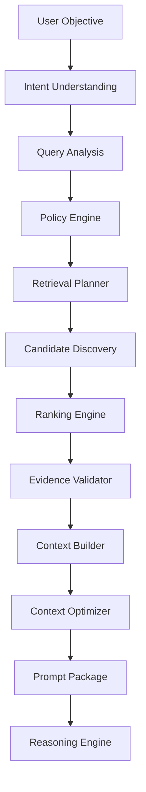

---
document:
  global_id: DOC-018
  capability_id: KNW-007

  title: KNOWLEDGE_RETRIEVAL_ARCHITECTURE

  version: 1.0.0

  status: Draft

  owner: Enterprise Architecture Board

  release: ECOS v1.0

  capability: Knowledge

  category: Capability Architecture

  type: Enterprise Retrieval Architecture

architecture:

  layer: Knowledge

  abstraction: Retrieval

  maturity: Enterprise

  reusable: true

  ai_native: true

  vendor_neutral: true

  implementation_independent: true
---

# Knowledge Retrieval Architecture

## Enterprise Reference Specification

---

# Executive Summary

The Retrieval Capability is the intelligence responsible for discovering, selecting, validating, ranking and assembling enterprise knowledge before it is consumed by downstream cognitive capabilities.

Within ECOS, Retrieval is not considered a database query nor a vector search.

Retrieval is a complete cognitive capability whose objective is to transform enterprise knowledge into trusted contextual evidence.

The Retrieval Capability provides context to:

- Memory
- Reasoning
- Planning
- Execution
- Agent Platform
- Future Cognitive Capabilities

Every AI decision produced by ECOS depends on Retrieval quality.

Therefore Retrieval is treated as a first-class enterprise capability.

---

# Mission

Deliver the most relevant, trustworthy, explainable and policy-compliant knowledge required to solve a user objective.

---

# Vision

Provide the world's most extensible enterprise retrieval architecture capable of combining semantic understanding, lexical search, knowledge graphs, governance policies and business intelligence into a unified context generation engine.

---

# Why Retrieval Exists

Large Language Models do not possess authoritative enterprise knowledge.

Knowledge resides inside organizations.

Retrieval bridges the gap between enterprise knowledge and artificial intelligence.

Without Retrieval:

- responses hallucinate
- policies are ignored
- outdated information is used
- business rules disappear
- governance cannot exist

Retrieval converts enterprise knowledge into AI context.

---

# Core Philosophy

ECOS Retrieval is NOT:

- Vector Search
- Database Search
- Keyword Search
- SQL Query
- Embedding Lookup

ECOS Retrieval IS:

An enterprise process that constructs trusted contextual evidence.

---

# Enterprise Objectives

The Retrieval Capability SHALL:

- maximize relevance
- minimize hallucination
- preserve governance
- respect security
- provide explainability
- remain vendor independent
- support hybrid retrieval
- optimize latency
- maximize context quality
- preserve semantic integrity

---

# Design Principles

## Principle 1

Context before Generation.

Generation never occurs before Retrieval.

---

## Principle 2

Meaning before Similarity.

Semantic understanding has priority over vector distance.

---

## Principle 3

Evidence before Confidence.

Answers require evidence.

Confidence without evidence has no architectural value.

---

## Principle 4

Governance before Retrieval.

Knowledge violating policy SHALL never be retrieved.

---

## Principle 5

Context over Documents.

The consumer never requests documents.

The consumer requests contextual evidence.

---

## Principle 6

Multiple Retrieval Strategies.

No single retrieval algorithm solves every problem.

---

## Principle 7

Retrieval is Observable.

Every retrieval decision shall be explainable.

---

# Capability Responsibilities

The Retrieval Capability owns:

- Query Analysis
- Intent Detection
- Query Expansion
- Retrieval Planning
- Candidate Discovery
- Candidate Ranking
- Evidence Validation
- Context Assembly
- Context Optimization
- Retrieval Metrics
- Retrieval Observability
- Retrieval Governance

---

# Capability Boundaries

Owned

✓ Retrieval

✓ Ranking

✓ Context

✓ Evidence

✓ Policies

✓ Retrieval Metrics

Not Owned

✗ Knowledge Ingestion

✗ Chunk Generation

✗ Metadata Creation

✗ Embedding Generation

✗ Memory

✗ Reasoning

✗ Planning

✗ Prompt Execution

---

# Enterprise Retrieval Pipeline

```text
User Objective

↓

Intent Analysis

↓

Query Understanding

↓

Policy Evaluation

↓

Retrieval Planning

↓

Candidate Generation

↓

Candidate Validation

↓

Ranking

↓

Re-ranking

↓

Evidence Validation

↓

Context Assembly

↓

Context Compression

↓

Prompt Package

↓

Consumer
```

---

# Retrieval High-Level Architecture



---

# Retrieval Lifecycle

Every retrieval request follows a deterministic lifecycle.

Stage 1

Receive User Objective

↓

Stage 2

Understand User Intent

↓

Stage 3

Identify Knowledge Domains

↓

Stage 4

Evaluate Security Policies

↓

Stage 5

Select Retrieval Strategies

↓

Stage 6

Collect Candidates

↓

Stage 7

Rank Candidates

↓

Stage 8

Validate Evidence

↓

Stage 9

Assemble Context

↓

Stage 10

Compress Context

↓

Stage 11

Deliver Context Package

---

# Enterprise Retrieval Components

The Retrieval Capability is composed of the following logical engines:

- Intent Engine
- Query Analyzer
- Policy Engine
- Retrieval Planner
- Candidate Discovery Engine
- Hybrid Search Engine
- Semantic Retrieval Engine
- Lexical Retrieval Engine
- Knowledge Graph Retriever
- Metadata Retriever
- Business Rules Retriever
- Ranking Engine
- Re-ranking Engine
- Evidence Validator
- Context Builder
- Context Optimizer
- Prompt Package Builder
- Metrics Engine
- Audit Engine
- Observability Engine

---

# Architecture Decision Records

## ADR-KNW-007-001

Retrieval SHALL be implemented as an independent enterprise capability.

---

## ADR-KNW-007-002

Retrieval SHALL return contextual evidence instead of documents.

---

## ADR-KNW-007-003

Multiple retrieval strategies SHALL coexist.

---

## ADR-KNW-007-004

Vector similarity SHALL NEVER be the only ranking criterion.

---

## ADR-KNW-007-005

Every retrieval decision SHALL be explainable.

---

# Dependencies

KNW-001

KNW-002

KNW-003

KNW-004

KNW-005

KNW-006

---

# Related Documents

KNW-008 Knowledge Vector Abstraction

KNW-009 Knowledge Graph Architecture

---

# Approval

Status

Draft

Pending Enterprise Architecture Board Approval.
