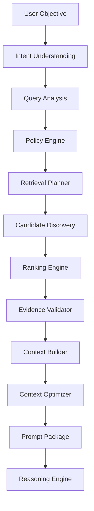
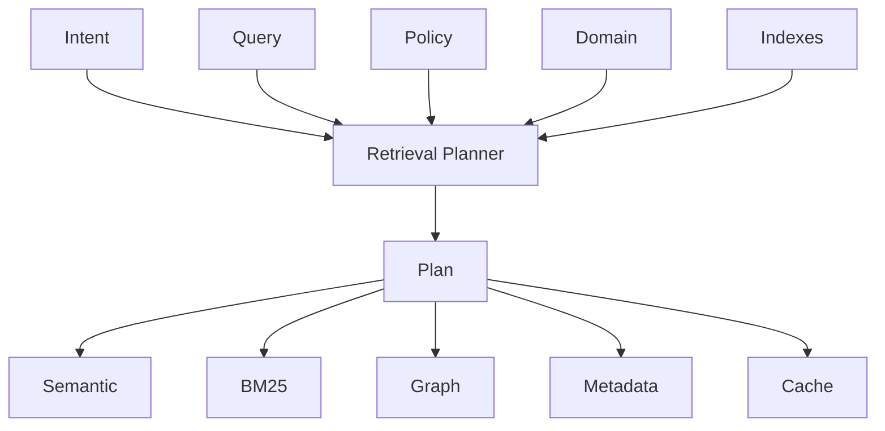
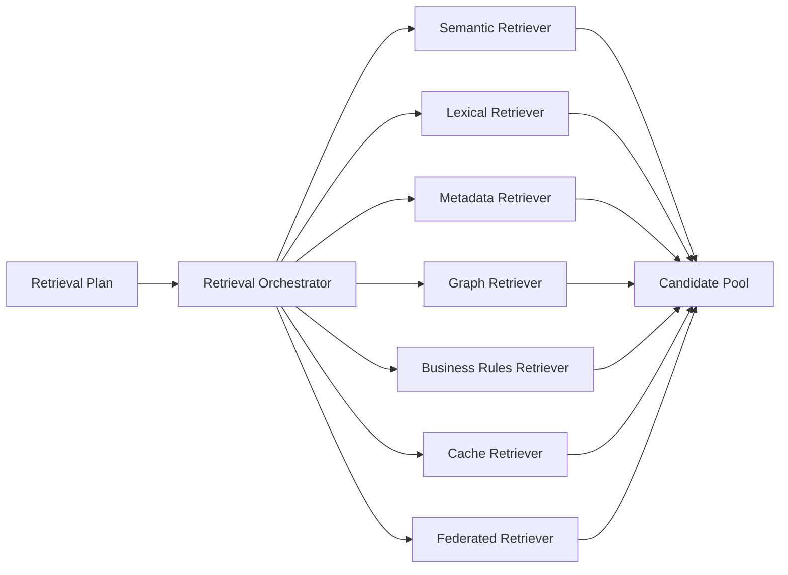
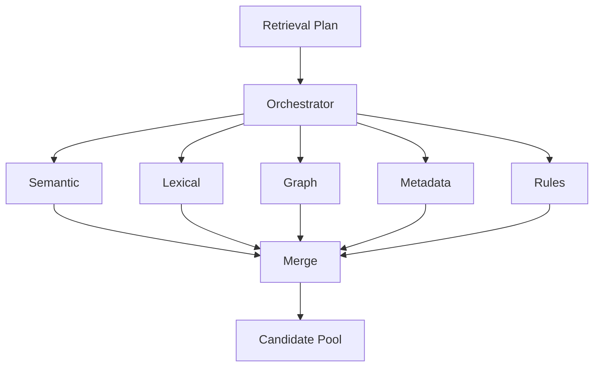

---
document:
  global_id: DOC-018
  capability_id: KNW-007

  title: KNOWLEDGE_RETRIEVAL_ARCHITECTURE

  version: 1.0.0

  status: Draft

  owner: Enterprise Architecture Board

  release: ECOS v1.0

  capability: Knowledge

  category: Capability Architecture

  type: Enterprise Retrieval Architecture

architecture:

  layer: Knowledge

  abstraction: Retrieval

  maturity: Enterprise

  reusable: true

  ai_native: true

  vendor_neutral: true

  implementation_independent: true
---

# Knowledge Retrieval Architecture

## Enterprise Reference Specification

---

# Executive Summary

The Retrieval Capability is the intelligence responsible for discovering, selecting, validating, ranking and assembling enterprise knowledge before it is consumed by downstream cognitive capabilities.

Within ECOS, Retrieval is not considered a database query nor a vector search.

Retrieval is a complete cognitive capability whose objective is to transform enterprise knowledge into trusted contextual evidence.

The Retrieval Capability provides context to:

- Memory
- Reasoning
- Planning
- Execution
- Agent Platform
- Future Cognitive Capabilities

Every AI decision produced by ECOS depends on Retrieval quality.

Therefore Retrieval is treated as a first-class enterprise capability.

---

# Mission

Deliver the most relevant, trustworthy, explainable and policy-compliant knowledge required to solve a user objective.

---

# Vision

Provide the world's most extensible enterprise retrieval architecture capable of combining semantic understanding, lexical search, knowledge graphs, governance policies and business intelligence into a unified context generation engine.

---

# Why Retrieval Exists

Large Language Models do not possess authoritative enterprise knowledge.

Knowledge resides inside organizations.

Retrieval bridges the gap between enterprise knowledge and artificial intelligence.

Without Retrieval:

- responses hallucinate
- policies are ignored
- outdated information is used
- business rules disappear
- governance cannot exist

Retrieval converts enterprise knowledge into AI context.

---

# Core Philosophy

ECOS Retrieval is NOT:

- Vector Search
- Database Search
- Keyword Search
- SQL Query
- Embedding Lookup

ECOS Retrieval IS:

An enterprise process that constructs trusted contextual evidence.

---

# Enterprise Objectives

The Retrieval Capability SHALL:

- maximize relevance
- minimize hallucination
- preserve governance
- respect security
- provide explainability
- remain vendor independent
- support hybrid retrieval
- optimize latency
- maximize context quality
- preserve semantic integrity

---

# Design Principles

## Principle 1

Context before Generation.

Generation never occurs before Retrieval.

---

## Principle 2

Meaning before Similarity.

Semantic understanding has priority over vector distance.

---

## Principle 3

Evidence before Confidence.

Answers require evidence.

Confidence without evidence has no architectural value.

---

## Principle 4

Governance before Retrieval.

Knowledge violating policy SHALL never be retrieved.

---

## Principle 5

Context over Documents.

The consumer never requests documents.

The consumer requests contextual evidence.

---

## Principle 6

Multiple Retrieval Strategies.

No single retrieval algorithm solves every problem.

---

## Principle 7

Retrieval is Observable.

Every retrieval decision shall be explainable.

---

# Capability Responsibilities

The Retrieval Capability owns:

- Query Analysis
- Intent Detection
- Query Expansion
- Retrieval Planning
- Candidate Discovery
- Candidate Ranking
- Evidence Validation
- Context Assembly
- Context Optimization
- Retrieval Metrics
- Retrieval Observability
- Retrieval Governance

---

# Capability Boundaries

Owned

✓ Retrieval

✓ Ranking

✓ Context

✓ Evidence

✓ Policies

✓ Retrieval Metrics

Not Owned

✗ Knowledge Ingestion

✗ Chunk Generation

✗ Metadata Creation

✗ Embedding Generation

✗ Memory

✗ Reasoning

✗ Planning

✗ Prompt Execution

---

# Enterprise Retrieval Pipeline

```text
User Objective

↓

Intent Analysis

↓

Query Understanding

↓

Policy Evaluation

↓

Retrieval Planning

↓

Candidate Generation

↓

Candidate Validation

↓

Ranking

↓

Re-ranking

↓

Evidence Validation

↓

Context Assembly

↓

Context Compression

↓

Prompt Package

↓

Consumer
```

---

# Retrieval High-Level Architecture



---

# Retrieval Lifecycle

Every retrieval request follows a deterministic lifecycle.

Stage 1

Receive User Objective

↓

Stage 2

Understand User Intent

↓

Stage 3

Identify Knowledge Domains

↓

Stage 4

Evaluate Security Policies

↓

Stage 5

Select Retrieval Strategies

↓

Stage 6

Collect Candidates

↓

Stage 7

Rank Candidates

↓

Stage 8

Validate Evidence

↓

Stage 9

Assemble Context

↓

Stage 10

Compress Context

↓

Stage 11

Deliver Context Package

---

# Enterprise Retrieval Components

The Retrieval Capability is composed of the following logical engines:

- Intent Engine
- Query Analyzer
- Policy Engine
- Retrieval Planner
- Candidate Discovery Engine
- Hybrid Search Engine
- Semantic Retrieval Engine
- Lexical Retrieval Engine
- Knowledge Graph Retriever
- Metadata Retriever
- Business Rules Retriever
- Ranking Engine
- Re-ranking Engine
- Evidence Validator
- Context Builder
- Context Optimizer
- Prompt Package Builder
- Metrics Engine
- Audit Engine
- Observability Engine

---

# Architecture Decision Records

## ADR-KNW-007-001

Retrieval SHALL be implemented as an independent enterprise capability.

---

## ADR-KNW-007-002

Retrieval SHALL return contextual evidence instead of documents.

---

## ADR-KNW-007-003

Multiple retrieval strategies SHALL coexist.

---

## ADR-KNW-007-004

Vector similarity SHALL NEVER be the only ranking criterion.

---

## ADR-KNW-007-005

Every retrieval decision SHALL be explainable.

---

# Dependencies

KNW-001

KNW-002

KNW-003

KNW-004

KNW-005

KNW-006

---

# Related Documents

KNW-008 Knowledge Vector Abstraction

KNW-009 Knowledge Graph Architecture

---

# Approval

Status

Draft

Pending Enterprise Architecture Board Approval.

---

# Part 2 — Intent Understanding & Retrieval Planning

---

# Executive Summary

The first responsibility of the Retrieval Capability is not searching.

Its first responsibility is understanding.

Searching before understanding introduces unnecessary ambiguity, poor relevance and low-quality contextual evidence.

The Retrieval Capability SHALL understand the user's objective before selecting any retrieval strategy.

---

# Canonical Retrieval Flow

```text
User Request

↓

Intent Understanding

↓

Query Analysis

↓

Context Expansion

↓

Policy Evaluation

↓

Retrieval Planning

↓

Candidate Discovery

...
```

Understanding precedes Retrieval.

---

# Intent Understanding Engine

## Purpose

The Intent Understanding Engine identifies the actual objective behind a request.

The objective is not keyword extraction.

The objective is semantic understanding.

---

## Responsibilities

The engine SHALL:

- detect intent
- identify requested knowledge
- classify business domain
- identify requested entities
- determine expected output
- identify urgency
- detect ambiguity
- detect missing context
- determine confidence

---

## Input

Natural language request

API request

Agent request

Workflow request

System event

---

## Output

Intent Object

---

Example

```yaml
intent:

  id: intent-001

  type: Knowledge Lookup

  domain: Retail

  goal: Find Promotion Policy

  confidence: 0.97

  requires_context: true

  priority: High
```

---

# Intent Categories

Supported enterprise intents include:

- Knowledge Lookup
- Policy Lookup
- Procedure Lookup
- API Discovery
- Code Search
- Document Search
- FAQ
- Compliance Verification
- Architecture Search
- Configuration Search
- Historical Search
- Comparative Search
- Decision Support
- Recommendation
- Root Cause Investigation
- Context Completion

Future versions may introduce additional intent categories.

---

# Intent Detection Pipeline


---

# Query Analyzer

## Purpose

Transform the original request into a structured enterprise query.

---

## Responsibilities

The Query Analyzer SHALL:

- normalize language
- remove ambiguity
- identify concepts
- extract entities
- identify dates
- identify products
- identify customers
- identify locations
- identify business units
- identify technical terminology
- detect filters
- identify exclusions
- generate semantic representation

---

# Example

User

> Show the latest pricing policy for supermarkets in Bogotá.

Query Object

```yaml
query:

  type: Policy

  entity: Pricing Policy

  filters:

    city: Bogotá

    business: Retail

    time: Latest

  language: Spanish
```

---

# Ambiguity Resolution

If ambiguity exists the Retrieval Engine SHALL:

- identify ambiguity
- estimate confidence
- attempt contextual disambiguation
- request clarification when necessary

---

Example

User

> Show promotions.

Ambiguous.

Possible meanings

- Retail promotions
- Marketing campaigns
- Discount policies
- Historical promotions
- Upcoming promotions

Retrieval SHALL NOT assume.

---

# Context Expansion

Purpose

Expand the user's request using enterprise knowledge.

Example

User

> Chicken promotion

Expanded Context

Chicken

↓

Meat

↓

Fresh Food

↓

Perishable Products

↓

Retail Promotions

↓

Current Campaign

↓

Regional Availability

Context expansion improves retrieval quality.

---

# Enterprise Context Sources

Expansion may use:

- Taxonomy
- Ontology
- Knowledge Graph
- Metadata
- Business Rules
- Historical Usage
- User Profile
- Conversation Context
- Previous Retrievals
- Domain Vocabulary

---

# Query Enrichment

Every query SHALL be enriched with:

- semantic concepts
- enterprise taxonomy
- ontology references
- business vocabulary
- known aliases
- abbreviations
- language normalization
- organizational terminology

---

# Retrieval Planning

Purpose

Determine the optimal retrieval strategy.

Retrieval planning occurs before any search operation.

---

## Responsibilities

The planner SHALL decide:

- Which retrievers execute.
- Execution order.
- Parallel execution.
- Fallback strategies.
- Ranking strategy.
- Compression strategy.
- Evidence validation strategy.

---

# Retrieval Planner Inputs

- Intent
- Query
- Policies
- Metadata
- Available indexes
- Knowledge domains
- User permissions
- Latency objectives

---

# Planner Outputs

Retrieval Plan

Example

```yaml
plan:

  semantic_search: true

  bm25: true

  knowledge_graph: false

  metadata_filter: true

  reranking: true

  compression: adaptive

  top_k: 40

  final_context: 12
```

---

# Retrieval Strategies

The planner supports:

- Semantic Retrieval
- Lexical Retrieval
- Metadata Retrieval
- Graph Retrieval
- Rule-Based Retrieval
- Hybrid Retrieval
- Federated Retrieval
- Cache Retrieval
- Hierarchical Retrieval
- Adaptive Retrieval

---

# Strategy Selection Rules

Example

Policy Search

↓

Metadata

↓

Semantic

↓

Business Rules

---

API Search

↓

Lexical

↓

Metadata

↓

Semantic

---

Architecture Search

↓

Semantic

↓

Knowledge Graph

↓

Metadata

---

Historical Search

↓

Metadata

↓

Time Filter

↓

Semantic

---

# Adaptive Planning

The Retrieval Planner SHALL adapt according to:

- intent
- knowledge domain
- latency budget
- context size
- confidence
- retrieval history
- available indexes
- security restrictions

---

# Planner Diagram



---

# Failure Handling

If planning fails:

- fallback planner
- safe retrieval
- minimal retrieval
- cached retrieval
- request clarification
- never generate unsupported context

---

# Architecture Decisions (Part 2)

## ADR-KNW-007-006

Understanding precedes Retrieval.

---

## ADR-KNW-007-007

Intent determines strategy.

---

## ADR-KNW-007-008

Planning is deterministic.

---

## ADR-KNW-007-009

Query enrichment SHALL preserve semantic meaning.

---

## ADR-KNW-007-010

Retrieval strategies SHALL remain replaceable.

---

# KPIs (Part 2)

Intent Detection Accuracy

Planner Accuracy

Average Planning Latency

Query Enrichment Coverage

Context Expansion Effectiveness

Ambiguity Resolution Rate

---

# Part 3 — Candidate Discovery & Multi-Strategy Retrieval

---

# Executive Summary

After the Retrieval Planner produces the Retrieval Plan, execution begins.

The objective is not to retrieve documents.

The objective is to discover the highest quality evidence available across the enterprise.

Evidence may originate from multiple heterogeneous knowledge systems.

The Retrieval Engine SHALL coordinate all retrieval mechanisms without exposing implementation complexity to downstream consumers.

---

# Retrieval Execution Model

Retrieval execution follows this canonical sequence:

```text
Retrieval Plan

↓

Candidate Discovery

↓

Parallel Retrieval

↓

Evidence Collection

↓

Evidence Normalization

↓

Candidate Pool

↓

Ranking
```

---

# Retrieval Orchestrator

## Purpose

The Retrieval Orchestrator coordinates every retrieval strategy.

It is responsible for:

- launching retrievers;
- managing execution order;
- controlling concurrency;
- enforcing latency budgets;
- collecting evidence;
- handling failures;
- producing the Candidate Pool.

The Orchestrator SHALL NOT implement search algorithms directly.

---

## Orchestrator Responsibilities

The Orchestrator SHALL:

- execute retrieval plans;
- invoke retrievers;
- manage parallel execution;
- merge results;
- remove duplicates;
- preserve evidence lineage;
- enforce governance policies;
- collect execution metrics.

---

# Candidate Discovery

## Definition

Candidate Discovery is the process of locating every potentially relevant Knowledge Chunk before ranking occurs.

Discovery favors recall.

Ranking favors precision.

These concerns SHALL remain independent.

---

# Candidate Discovery Sources

The Discovery Engine may retrieve candidates from:

- Semantic Index
- Lexical Index
- Metadata Index
- Knowledge Graph
- Business Rules Repository
- Frequently Accessed Cache
- Conversation Context
- External Enterprise Connectors
- Federated Knowledge Domains
- Archived Knowledge

---

# Retrieval Execution Diagram



---

# Semantic Retriever

## Purpose

Discover semantically related Knowledge Chunks.

The Semantic Retriever SHALL:

- operate over semantic representations;
- understand conceptual similarity;
- support multilingual retrieval;
- preserve semantic integrity;
- remain provider independent.

Inputs

- semantic query;
- embedding reference;
- retrieval filters.

Outputs

Candidate Chunks.

---

# Lexical Retriever

## Purpose

Retrieve exact textual evidence.

Typical use cases:

- API names
- configuration files
- product codes
- SKUs
- error messages
- log identifiers
- version numbers
- source code

Lexical retrieval complements semantic retrieval.

It does not replace it.

---

# Metadata Retriever

## Purpose

Retrieve evidence using metadata instead of content.

Supported filters include:

- owner;
- business unit;
- language;
- creation date;
- classification;
- lifecycle;
- tags;
- document type;
- geographic region.

---

# Knowledge Graph Retriever

## Purpose

Navigate relationships between enterprise concepts.

Instead of similarity, Graph Retrieval explores:

- dependencies;
- hierarchies;
- ownership;
- references;
- semantic relations.

Example

Promotion

↓

Store

↓

Region

↓

Campaign

↓

Supplier

↓

Product

---

# Business Rules Retriever

## Purpose

Retrieve governed business rules.

Examples:

- Pricing rules
- Compliance rules
- Security rules
- Retention policies
- Operational procedures

Business rules SHALL always override statistical relevance when required by policy.

---

# Cache Retriever

Purpose

Reuse previously validated contextual evidence.

Supported cache levels:

L1 — Request Cache

L2 — Conversation Cache

L3 — Session Cache

L4 — Enterprise Retrieval Cache

Cache SHALL never bypass governance validation.

---

# Federated Retriever

Purpose

Retrieve knowledge from multiple enterprise domains.

Examples

- HR
- Finance
- Retail
- Engineering
- Legal
- Security
- Partners
- Cloud Services

Each domain remains autonomous.

Retrieval remains unified.

---

# Retrieval Parallelism

Multiple retrievers SHALL execute simultaneously whenever possible.



---

# Candidate Pool

Definition

The Candidate Pool contains every potential evidence object before ranking.

Candidate objects SHALL include:

- Chunk ID
- Asset ID
- Source
- Retriever Origin
- Preliminary Score
- Confidence
- Metadata
- Lineage Reference

---

# Duplicate Detection

Before ranking, duplicates SHALL be removed.

Duplicate detection considers:

- semantic similarity;
- identical assets;
- overlapping chunks;
- canonical identifiers;
- document versions.

---

# Candidate Normalization

Every candidate SHALL be normalized into the canonical ECOS Retrieval Candidate model.

Required fields:

- Candidate ID
- Knowledge Asset
- Chunk Reference
- Retriever Source
- Preliminary Score
- Metadata
- Evidence Type
- Confidence
- Timestamp

---

# Latency Budget

Every retriever SHALL respect execution budgets.

Example

Semantic Retriever ≤ 150 ms

Lexical Retriever ≤ 50 ms

Metadata Retriever ≤ 30 ms

Cache Retriever ≤ 10 ms

The Orchestrator MAY terminate slow retrievers if the latency budget is exceeded.

---

# Failure Strategy

Retriever failures SHALL NOT terminate retrieval.

Instead:

- log failure;
- continue with remaining retrievers;
- adjust confidence;
- record missing evidence.

---

# Architecture Decisions (Part 3)

## ADR-KNW-007-011

Retrieval SHALL use multiple specialized retrievers.

---

## ADR-KNW-007-012

Candidate Discovery maximizes recall.

---

## ADR-KNW-007-013

Ranking SHALL occur only after Candidate Pool construction.

---

## ADR-KNW-007-014

Every candidate SHALL preserve lineage.

---

## ADR-KNW-007-015

Retriever implementations remain independently replaceable.

---

# KPIs (Part 3)

Candidate Recall

Retriever Latency

Duplicate Detection Rate

Candidate Coverage

Retriever Availability

Federated Retrieval Success

Parallel Execution Efficiency
