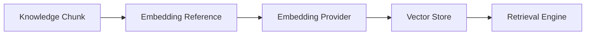

---
document:
  global_id: DOC-019
  capability_id: KNW-008

  title: KNOWLEDGE_VECTOR_ABSTRACTION

  version: 1.0.0

  status: Draft

  owner: Enterprise Architecture Board

  release: ECOS v1.0

  capability: Knowledge

  category: Information Architecture

  type: Vector Abstraction

architecture:

  layer: Knowledge

  abstraction: Semantic Representation

  audience:

    - AI Engineers
    - Enterprise Architects
    - Knowledge Engineers
    - Platform Engineers

  maturity: Core

  reusable: true
---

# Knowledge Vector Abstraction

---

# Executive Summary

The Knowledge Capability represents semantic meaning through abstract vector representations.

ECOS intentionally separates semantic representation from vector database technologies and embedding providers.

Vectors are implementation artifacts, not knowledge objects.

---

# Purpose

This specification defines:

- vector abstraction;
- semantic representation;
- provider independence;
- embedding lifecycle;
- vector governance;
- interoperability.

---

# Core Principle

Knowledge exists independently of vectors.

Vectors are one possible semantic representation of knowledge.

Future representations may coexist without changing the Knowledge Capability interfaces.

---

# Design Principles

The abstraction shall be:

- provider independent;
- storage independent;
- embedding model independent;
- version controlled;
- replaceable;
- extensible;
- observable.

---

# Canonical Concepts

## Embedding Reference

Logical identifier of a semantic representation.

It does not contain the vector itself.

---

## Embedding Provider

Responsible for generating semantic representations.

Examples:

- OpenAI
- Voyage AI
- Cohere
- NVIDIA
- Google
- Local models

Providers remain interchangeable.

---

## Vector Store

Persistence technology.

Examples:

- pgvector
- Pinecone
- Weaviate
- Milvus
- Qdrant
- Chroma

The Vector Store is not part of the Knowledge domain model.

---

## Similarity Strategy

Defines how semantic similarity is calculated.

Possible strategies:

- Cosine Similarity
- Dot Product
- Euclidean Distance
- Hybrid Strategies

Strategies remain configurable.

---

## Embedding Version

Represents the semantic generation version.

Every generated representation SHALL reference:

- provider;
- model;
- version;
- creation timestamp.

---

# Logical Relationships

---

# Lifecycle

Knowledge Chunk

↓

Embedding Request

↓

Embedding Generation

↓

Validation

↓

Registration

↓

Publication

↓

Retrieval

↓

Regeneration

↓

Retirement

---

# Versioning Rules

Embedding regeneration SHALL NOT modify:

- Chunk Identifier
- Asset Identifier
- Metadata
- Governance State

Only the semantic representation changes.

---

# Provider Independence

The Knowledge Capability SHALL support replacing embedding providers without changing:

- APIs
- Knowledge Assets
- Metadata
- Chunks
- Retrieval Interfaces

---

# Storage Independence

The abstraction SHALL support multiple vector persistence technologies simultaneously.

Migration between providers shall not affect business consumers.

---

# Constraints

Embedding References SHALL:

- belong to exactly one Chunk;
- reference one active embedding version;
- preserve history;
- remain immutable once published.

---

# Architecture Decisions

## ADR-KNW-008-001

Vectors are implementation details.

---

## ADR-KNW-008-002

Knowledge is independent of embeddings.

---

## ADR-KNW-008-003

Embedding providers remain replaceable.

---

## ADR-KNW-008-004

Multiple semantic representations may coexist.

---

# KPIs

Embedding Freshness

Provider Availability

Embedding Regeneration Time

Semantic Recall

Embedding Version Coverage

---

# Risks

Vendor lock-in

Embedding drift

Provider incompatibility

Vector corruption

Representation inconsistency

---

# Success Criteria

The abstraction is successful when:

Knowledge remains independent of vector technologies.

Providers can be replaced transparently.

Multiple embedding strategies coexist.

Semantic retrieval remains stable despite implementation changes.

---

# Dependencies

KNW-004

KNW-005

KNW-006

KNW-007

---

# Related Documents

KNW-009 Knowledge Graph Architecture

KNW-010 Physical Architecture

---

# References

Vector Databases

Approximate Nearest Neighbor Algorithms

Embedding Models

Enterprise Knowledge Management

ISO/IEC 42010

---

# Approval

Status

Draft

Pending Enterprise Architecture Board Approval.
