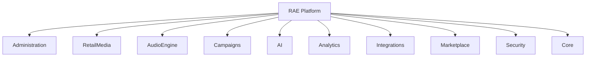
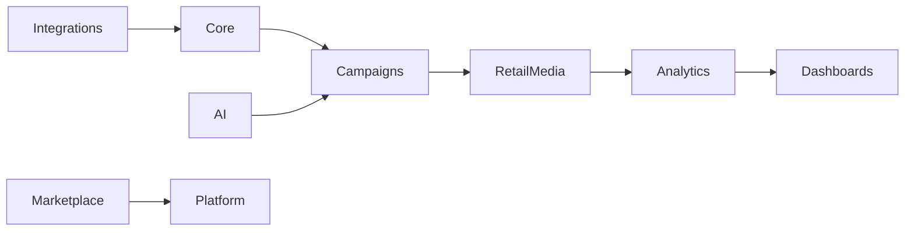

---
document:
  id: DOC-101
  title: PRODUCT_ARCHITECTURE
  version: 0.1.0
  status: Draft
  category: Product
  type: Architecture
  owner: RAE Platform Architecture
  release: v0.3.0 Product
  domain: Product
  ddl: DDL-1
---

# Product Architecture

> Official functional architecture of RAE Platform.

---

# Executive Summary

This document defines the functional architecture of RAE Platform.

It establishes how the platform is organized from a business and product perspective, independently of implementation technologies.

The architecture is modular, scalable, AI-First and vendor-neutral.

---

# Architecture Principles

The architecture follows these principles:

- Modular by Design
- AI-First
- API-First
- Cloud Native
- Event Driven
- Multi-Tenant
- Enterprise Ready
- Secure by Design
- Vendor Independent
- Extensible

---

# Functional Architecture Overview



---

# Functional Layers

```text
Presentation Layer

↓

Business Layer

↓

Domain Layer

↓

Shared Services

↓

Integration Layer

↓

Infrastructure Layer
```

Each layer has clear responsibilities.

Dependencies always flow downward.

---

# Core Domains

The platform is divided into major domains.

## Core Platform

Identity

Organizations

Users

Permissions

Configuration

Audit

---

## Audio Management

Playlists

Scheduling

Streaming

Zones

Devices

Libraries

---

## Retail Media

Campaign Manager

Media Inventory

Advertising Marketplace

Billing

Audience Analytics

AI Optimization

---

## Artificial Intelligence

AI Agents

AI Copywriter

Music Generation

Recommendations

Predictions

Automation

---

## Analytics

Executive Dashboards

KPIs

Predictions

Reports

Real-Time Metrics

---

## Integrations

API Gateway

Webhooks

SDK

External Systems

ERP

CRM

POS

---

## Marketplace

Templates

AI Agents

Plugins

Music Packs

Campaign Packs

Integrations

---

# Shared Services

Cross-platform services include:

Authentication

Authorization

Notifications

Audit

Logging

Monitoring

Storage

Search

Caching

Messaging

Localization

Feature Flags

Licensing

Billing

---

# Cross-Cutting Concerns

Every module supports:

Security

Observability

Telemetry

Audit

Localization

Accessibility

Scalability

Documentation

AI Readiness

---

# Product Boundaries

The platform does not hard-code external providers.

Every provider is abstracted through adapters.

Examples:

Music Generation

↓

Voice Generation

↓

Cloud Storage

↓

Authentication

↓

Payments

↓

Maps

↓

Analytics

---

# Domain Relationships



---

# Evolution Strategy

New capabilities should be added by:

New Module

↓

New Capability

↓

New Feature

↓

New Integration

The architecture avoids modifying existing modules whenever possible.

---

# Scalability Targets

Support:

1 Tenant

↓

100 Tenants

↓

10,000 Tenants

↓

Millions of Users

↓

Millions of Campaigns

↓

Billions of Events

---

# Success Criteria

The architecture is successful when:

Modules remain independent.

Capabilities are reusable.

AI integrates naturally.

Product complexity remains manageable.

The platform evolves without architectural redesign.

---

# Related Documents

DOC-100 PRODUCT_VISION

DOC-102 MODULE_CATALOG

DOC-103 CAPABILITY_CATALOG

DOC-107 TENANT_MODEL

DOC-119 INTEGRATION_MODEL

---

# Approval

Status:

Draft (v0.1)

Pending Architecture Review.
